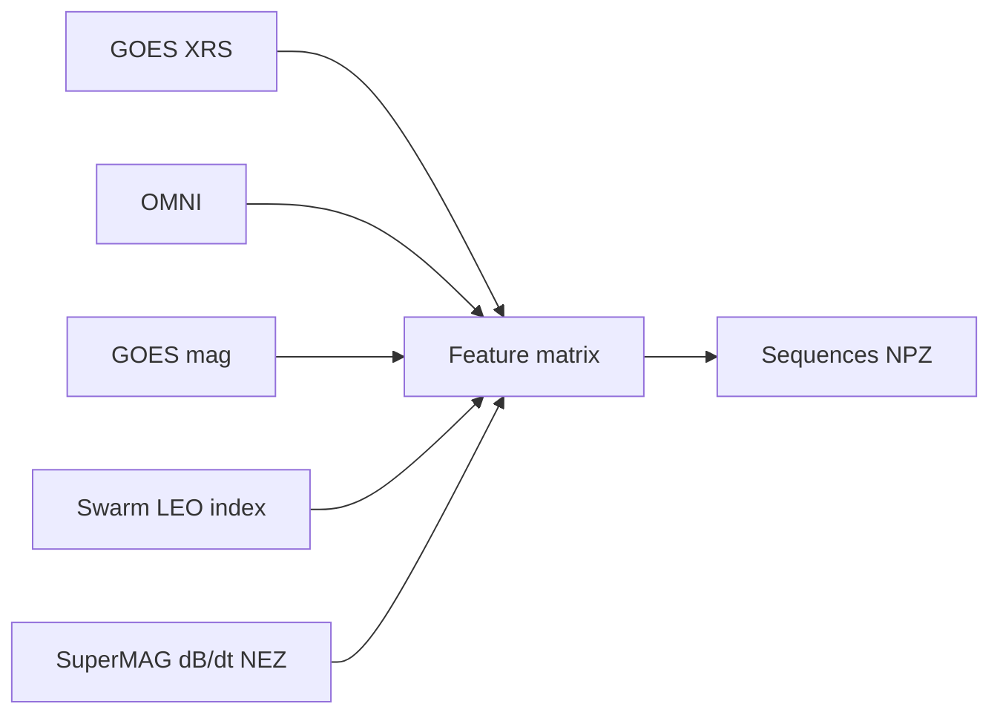

# Data pipeline architecture (2015–2024)

This document describes the end-to-end SWMI machine-learning data chain from solar drivers through L1, GEO, LEO, and ground targets. Scientific invariants (reference field, dB/dt method, split buffer) are fixed in `configs/feature_engineering.yaml` and `src/swmi/utils/config.py`.

## Chain overview

1. **Sun (precursor) — GOES X-ray (1–3 day event context)**  
   Multi-band XRS from GOES (legacy NCEI or modern NGDC) with cross-satellite `normalize_goes_xray()` and event-driven 24 h accumulators (not generic rolling “weather” windows). `electron_correction_flag` and contamination bits reject bad samples; **no `au_factor`**.

2. **L1 — OMNI 1-min HRO2**  
   Solar-wind/IMF propagated to the bow shock. Canonical columns feed Newell coupling and L1 gap flags.

3. **GEO — GOES magnetometer**  
   Sub-solar / merged GSM `Bz` (deterministic per-year `satellite_priority` in `configs/data_retrieval.yaml`). **GOES-19** is included in the 2024 table alongside GOES-16/18 for coverage through the 2015–2024 study period.

4. **LEO — Swarm A/B/C + LEO index**  
   1-Hz Swarm `MAG` is reduced to 1-min sub-indices. Reference field is **IGRF** or **CHAOS**; CHAOS uses **1-month (calendar) chunks** in `build_leo_index_month()` to limit memory. Outputs sit under `data/processed/swarm/YYYY/MM/`.

5. **Ground — SuperMAG**  
   NEZ `dB/dt` with `compute_dbdt_gap_aware()`; primary training target is **horizontal magnitude** `sqrt((dB/dt)_N^2 + (dB/dt)_E^2)`. Station lists come from **SuperMAGGetInventory** (no static global list in production). Metadata for long-run stations is cached in `data/external/station_metadata/`.

## Directory layout (canonical)

- `data/raw/{omni,goes,swarm,supermag}/` — monthly or consolidated Parquet/NetCDF staging  
- `data/interim/cleaned/` — optional cleaned steps  
- `data/processed/{omni,goes,swarm,supermag,aligned_1min,features,sequences}/` — analysis-ready and fused products  
- `data/sequences/{train,val,test}/` — exported `.npz` sequence tensors (see `scripts/03_build_sequences.py`)

## Data flow (simplified)

## Reprocessing

Any change to scientific invariants in YAML/Python requires **full reprocessing** from raw data (see warnings in the Prompt 1B specification).

## See also

- `docs/architecture/temporal_validation.md` — train/val/test timing  
- `docs/architecture/leakage_prevention.md` — anti-leakage design  
- `docs/architecture/leo_index_strategy.md` — LEO/CHAOS and DMSP deferral
