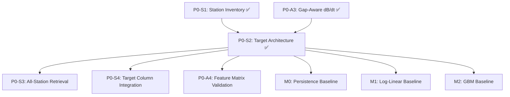

# Target Variable Architecture Decision

> **Status**: APPROVED — Option A selected  
> **Approved**: 2026-04-25  
> **Depends on**: P0-S1 (dynamic station inventory ✅), P0-A3 (gap-aware dB/dt ✅)  
> **Consumed by**: P0-S3, P0-S4, P0-A4, P0-E2, M0/M1/M2 baselines

---

## 1. Problem Statement

The SWMI pipeline forecasts geomagnetic hazard at 1-hour horizon.  The target
variable definition is the single most consequential design decision because it:

1. **Defines the scientific question** — what physical quantity we are predicting
2. **Constrains the loss function** — multi-output masking vs. scalar regression
3. **Determines station coverage** — all stations vs. index-contributing subset
4. **Controls leakage surface** — per-station temporal derivatives vs. global aggregates

This document evaluates three candidate target variable architectures and records
the approved decision.

---

## 2. Candidate Options

### Option A: Per-Station `dbdt_horizontal_magnitude` (SELECTED ✅)

**Definition:**
```
target[t+60, s] = sqrt(dbdt_n[t+60, s]² + dbdt_e[t+60, s]²)
```

Where `dbdt_n` and `dbdt_e` are backward-difference derivatives of the NEZ
magnetic field components at station `s`, using actual elapsed time (not
constant 60s).

**Implementation:** `compute_dbdt_gap_aware()` in
[cleaners.py](../../src/swmi/preprocessing/cleaners.py)

**Properties:**

| Property | Value |
|----------|-------|
| Dimensionality | Multi-output: one target per station per timestep |
| Physical meaning | Rate of horizontal magnetic field change (nT/min) |
| GIC relevance | Directly proportional to induced electric field via Faraday's law |
| Spatial resolution | Per-station (~200–400 stations from dynamic inventory) |
| Temporal resolution | 1-minute cadence |
| Missing data handling | NaN masking via `nan_aware_mse` loss |
| Gap treatment | `dbdt_gap_flag=1` → NaN target (no gradient contribution) |
| Leakage risk | LOW — backward diff uses only past data; gap masking prevents averaging across outages |

**Advantages:**
- Highest spatial resolution; every station is a direct forecast target
- GIC-relevant: dB/dt magnitude is the quantity that induces geoelectric fields
- Compatible with multi-output regression (M1, M2) and per-station LSTM (M3)
- NaN-aware loss naturally handles variable station availability across months
- Dynamic inventory (P0-S1) provides ground-truth station coverage per month

**Disadvantages:**
- High-dimensional output (~200–400 stations); requires careful aggregation for evaluation
- Station-level noise may degrade signal-to-noise for low-activity stations
- Evaluation must be stratified by latitude band (auroral vs. sub-auroral vs. mid-latitude)

---

### Option B: SuperMAG Index Targets (SME, SML, SMU)

**Definition:**
```
target[t+60] = SME[t+60]    # scalar
```

Where SME is the SuperMAG auroral electrojet index (equivalent to AE but
computed from the full network).

**Properties:**

| Property | Value |
|----------|-------|
| Dimensionality | Scalar (1 target per timestep) |
| Physical meaning | Global auroral electrojet activity |
| GIC relevance | INDIRECT — measures electrojet, not local dB/dt |
| Spatial resolution | Global aggregate (no station-level information) |
| Missing data handling | Indices are pre-computed; gaps are rare |
| Leakage risk | MODERATE — index computation aggregates across all stations, which could leak information about the spatial distribution |

**Advantages:**
- Scalar target simplifies the modeling problem dramatically
- Well-studied benchmark in space weather literature
- Robust to individual station outages (network-wide index)

**Disadvantages:**
- **Loses spatial resolution** — cannot identify which stations will experience extreme dB/dt
- Indices mask regional variability (e.g., strong dB/dt at ABK but quiet at lower latitudes)
- Not directly GIC-relevant (power grid operators need local dB/dt, not a global index)
- Comparison to published benchmarks is less valuable than producing actionable forecasts

---

### Option C: Hybrid (Station dB/dt + Index Auxiliary Loss)

**Definition:**
```
target_primary[t+60, s] = dbdt_horizontal_magnitude[t+60, s]  (per-station)
target_aux[t+60]        = SME[t+60]                           (scalar)
loss = λ₁ · nan_aware_mse(primary) + λ₂ · mse(aux)
```

**Properties:**

| Property | Value |
|----------|-------|
| Dimensionality | Multi-output + 1 scalar auxiliary |
| Physical meaning | Local dB/dt + global electrojet context |
| Leakage risk | MODERATE — auxiliary loss couples stations through global index |

**Advantages:**
- Preserves station-level resolution while regularizing toward global behavior
- The auxiliary loss provides a "sanity check" signal during training

**Disadvantages:**
- Adds hyperparameter complexity (λ₁, λ₂ balance)
- Auxiliary loss may fight the primary objective during quiet times
- Premature optimization — should validate Option A alone before adding complexity

---

## 3. Decision Matrix

| Criterion | Weight | Option A | Option B | Option C |
|-----------|--------|----------|----------|----------|
| GIC relevance | 0.30 | ★★★★★ | ★★☆☆☆ | ★★★★☆ |
| Spatial resolution | 0.25 | ★★★★★ | ★☆☆☆☆ | ★★★★★ |
| Implementation simplicity | 0.15 | ★★★★☆ | ★★★★★ | ★★☆☆☆ |
| Leakage safety | 0.15 | ★★★★★ | ★★★☆☆ | ★★★☆☆ |
| Literature comparability | 0.10 | ★★★☆☆ | ★★★★★ | ★★★☆☆ |
| Noise robustness | 0.05 | ★★★☆☆ | ★★★★★ | ★★★★☆ |
| **Weighted Score** | | **4.30** | **2.75** | **3.65** |

---

## 4. Approved Decision: Option A

**Per-station `dbdt_horizontal_magnitude` at T+60 minutes.**

### Implementation Invariants

These are locked and must not be modified without full reprocessing:

```yaml
# configs/feature_engineering.yaml
dbdt:
  method: "backward"               # operationally correct
  gap_threshold_sec: 90.0          # 1.5x expected cadence

# configs/model_baseline.yaml
forecast_horizon_min: 60           # target is dB/dt at T + 60 min
```

### Target Column Schema

The target column in the merged feature matrix is:

| Column | Type | Unit | Description |
|--------|------|------|-------------|
| `dbdt_horizontal_magnitude` | float64 | nT/min | `sqrt(dbdt_n² + dbdt_e²)` |
| `dbdt_gap_flag` | int8 | — | 1 if gap > 90s, 0 otherwise |
| `dbdt_n` | float64 | nT/min | North component derivative |
| `dbdt_e` | float64 | nT/min | East component derivative |
| `dbdt_z` | float64 | nT/min | Vertical component derivative (not used in target) |

### Evaluation Protocol

1. **Primary metric**: Weighted RMSE stratified by latitude band
   - Auroral (|QLat| ≥ 55°): highest weight (these stations matter most for GIC)
   - Sub-auroral (20° ≤ |QLat| < 55°): medium weight
   - Mid-latitude (|QLat| < 20°): lowest weight (quiet-time dominated)

2. **Secondary metrics**: Station-level MAE, hit/miss rate above threshold
   (e.g., dB/dt > 5 nT/min as "event" threshold)

3. **Baseline comparisons**:
   - M0 (persistence): dbdt_h_mag(t+60) = dbdt_h_mag(t)
   - M1 (log-linear): ridge regression on rolling-stat features
   - M2 (GBM): LightGBM per-station with full feature set

---

## 5. Fallback Escalation

If Option A proves intractable (e.g., >80% of stations produce noise-dominated
targets), escalate to:

1. **Reduce station count** — filter to top-N most active stations using
   dynamic inventory + activity ranking
2. **Spatial aggregation** — bin stations into latitude bands and predict
   band-mean dB/dt
3. **Option C** — add SME auxiliary loss to regularize
4. **Option B** — full retreat to scalar index prediction (last resort)

---

## 6. Dependency Map



---

## References

- Pulkkinen, A. et al. (2013). "Community-wide validation of geomagnetically
  induced current model predictions." *J. Space Weather Space Clim.* 3, A12.
  — Establishes dB/dt as the operationally relevant quantity for GIC.

- Gjerloev, J. W. (2012). "The SuperMAG data processing technique."
  *J. Geophys. Res.* 117, A09213. — Defines the NEZ coordinate system and
  baseline subtraction used in our data.

- Wintoft, P. et al. (2015). "Forecasting ground magnetic field fluctuations."
  *J. Space Weather Space Clim.* 5, A14. — Validates per-station dB/dt
  as a forecasting target.
