# Refactoring Task List: `fused_analysis.py` → Modular Pipeline
**Generated for:** Space Weather ML Capstone — Milestone 3 Refactor  
**Source audit:** `fusion_analysis_audit.md`  
**Source code:** `fused_analysis.py` (2,244 lines, monolithic)  
**Agent instruction:** Complete tasks in order. Do NOT begin a task if any `[CRITICAL]` dependency is unresolved. All subtasks marked `- [ ]` must be checked off before the task is considered done.

---

# SECTION 1 — COMPLETE TASK LIST

---

## ━━━━━━━━━━━━━━━━━━━━━━━━━━━━━━━━━━━━━━━━━━━━
## PHASE 0 — FOUNDATION
## ━━━━━━━━━━━━━━━━━━━━━━━━━━━━━━━━━━━━━━━━━━━━

---

### TASK-001: Build Canonical Constants Module
**Tags:** [CRITICAL]  
**File:** `config/constants.py`  
**Depends on:** *(none — first task)*  
**Audit source:** PART 1, items 1–3 (horizon mis-specification, cadence ambiguity, missing multi-threshold loop)  
**Failure if skipped:** Every downstream module that imports thresholds, horizons, or station lists will use inconsistent hard-coded values, propagating the original bugs into the refactored codebase.

**Subtasks:**
- [ ] Define `STATIONS = ['ABK', 'BJN', 'TRO']` and `TARGET_COLS` list derived from it
- [ ] Define `EVENT_THRESHOLDS = [0.3, 0.7, 1.1, 1.5]` (nT/s, all four GEM thresholds)
- [ ] Define `FORECAST_HORIZONS = [15, 30, 60]` (minutes) — three horizons, NOT one
- [ ] Define `CADENCE_MINUTES: int` as `None` (to be detected at runtime); provide `VALID_CADENCES = [1, 5]` and the mapping `HORIZON_STEPS: dict` = `{1: {15:15, 30:30, 60:60}, 5: {15:3, 30:6, 60:12}}`
- [ ] Define guard-band constant `SPLIT_GUARD_HOURS = 12`
- [ ] Define `TRAIN_END_YEAR = 2023`, `VAL_YEAR = 2023`, `TEST_YEAR = 2024` with explicit comments explaining the split protocol
- [ ] Define output directory paths (`DATA_DIR`, `OUTPUT_DIR`, `FIG_DIR`, etc.) as `pathlib.Path` constants
- [ ] Add a module-level `__all__` list covering every exported name
- [ ] Write a `pytest` unit test `tests/test_constants.py` asserting: `len(FORECAST_HORIZONS) == 3`, `len(EVENT_THRESHOLDS) == 4`, `SPLIT_GUARD_HOURS >= 12`

**Acceptance criteria:**
- `python -c "from config.constants import FORECAST_HORIZONS, EVENT_THRESHOLDS; assert len(FORECAST_HORIZONS)==3 and len(EVENT_THRESHOLDS)==4"` exits 0
- No `LEAD_STEPS = 60` hard-coded literal anywhere in the new codebase (grep check passes)

---

### TASK-002: Build Canonical Feature-Block Definitions
**Tags:** [CRITICAL]  
**File:** `config/feature_blocks.py`  
**Depends on:** TASK-001  
**Audit source:** PART 3, Leakage Audit — cross-station feature check; PART 2, all model gaps referencing feature set inconsistency  
**Failure if skipped:** Feature selection differs between EDA, training, and SHAP, making importance values incomparable across scripts.

**Subtasks:**
- [ ] Define `BLOCK1_SOLAR_WIND_COLS`: list of OMNI solar-wind column name patterns (Bz, Vx, Pdyn, density, Newell Φ and their rolling/lag variants)
- [ ] Define `BLOCK2_GEO_STATE_COLS`: GOES magnetometer columns (`goes_bx_gsm`, `goes_by_gsm`, `goes_bz_gsm`, `goes_bt`)
- [ ] Define `BLOCK3_LEO_ELECTROJET_COLS`: Swarm/CHAOS-derived column patterns — mark with `BLOCK3_STUB = True` flag and docstring noting CHAOS data dependency
- [ ] Define `BLOCK4_GROUND_PERSISTENCE_COLS`: lagged and rolling `{station}_dbdt_magnitude` column patterns
- [ ] Define `BLOCK5_CONDUCTANCE_COLS`: solar zenith angle, illumination fraction, conductance proxy columns
- [ ] Define `BLOCK6_MISSINGNESS_COLS`: `_missing_flag`, `goes_gap_flag`, `leo_decay_age`, `_is_fresh` patterns — these ARE model inputs (fixing Critical Failure 6)
- [ ] Define `BLOCK7_REGIME_CONTEXT_COLS`: regime cluster label columns (placeholder; populated in Phase 4)
- [ ] Define `ALL_FEATURE_BLOCKS: dict` mapping block name → column list
- [ ] Add `get_feature_cols(df, include_blocks=None, exclude_blocks=None) -> list[str]` helper that assembles the union of requested blocks intersected with `df.columns`
- [ ] Confirm `BLOCK6_MISSINGNESS_COLS` is NOT in the exclude list (audit Critical Failure 6 fix)

**Acceptance criteria:**
- `get_feature_cols(df, exclude_blocks=['BLOCK3'])` returns a list with no CHAOS-derived columns and at least one `_missing_flag` column when data contains those columns
- `get_feature_cols(df)` never returns any `_event` or `_dbdt_magnitude` column (target leak guard)

---

### TASK-003: Build Leakage Rules and Assertion Helpers
**Tags:** [CRITICAL], [LEAKAGE-GATE]  
**File:** `config/leakage_rules.py`  
**Depends on:** TASK-001, TASK-002  
**Audit source:** PART 3, full Leakage Audit Summary Table — AE/SYM-H leakage (conditional critical), target column contamination  
**Failure if skipped:** No automated gate exists to catch future column-level leakage; the AE/SYM-H contamination remains undetected.

**Subtasks:**
- [ ] Define `PROHIBITED_COLS: list[str]` = ground-index columns that must never appear as features: `['ae_index', 'dst_index', 'sym_h', 'asy_h', 'al_index', 'au_index', 'pc_index']` and their variant patterns
- [ ] Define `PROHIBITED_PATTERNS: list[str]` — regex patterns matching any future-derived column or index-contaminated column
- [ ] Implement `assert_no_leakage(df: pd.DataFrame, feature_cols: list[str]) -> None`: raises `AssertionError` with column name if any prohibited column is present in `feature_cols`
- [ ] Implement `assert_no_target_in_features(feature_cols: list[str], target_col: str) -> None`: raises `AssertionError` if target appears in features
- [ ] Implement `assert_temporal_order(df: pd.DataFrame) -> None`: asserts `df['timestamp'].is_monotonic_increasing`
- [ ] Leakage check: run `assert_no_leakage` against the full fused parquet column list and document any prohibited columns found; if found, file a blocker note
- [ ] Write `tests/test_leakage_rules.py` with at least three test cases: prohibited column detected, clean column passes, target-in-features detected

**Acceptance criteria:**
- `assert_no_leakage(df, ['ae_index', 'omni_bz_gsm'])` raises `AssertionError` mentioning `ae_index`
- `assert_no_leakage(df, ['omni_bz_gsm', 'newell_phi'])` passes silently
- Pytest suite `tests/test_leakage_rules.py` passes with zero failures

---

### TASK-004: Implement Parquet Loader with Cadence Detection
**Tags:** [CRITICAL]  
**File:** `data/loader.py`  
**Depends on:** TASK-001, TASK-003  
**Audit source:** PART 1, item 2 — cadence ambiguity; PART 5, Rank 1 fix  
**Failure if skipped:** Every label construction uses the wrong `LEAD_STEPS`, silently shifting labels by 5× if cadence is 5-min instead of 1-min.

**Subtasks:**
- [ ] Implement `load_fused_parquet(data_dir: Path) -> pd.DataFrame`: loads all year/month partitions, concatenates, sorts by timestamp
- [ ] Implement `detect_cadence(df: pd.DataFrame) -> int`: computes median timedelta between consecutive rows in minutes; asserts result is in `VALID_CADENCES`; raises `ValueError` with clear message if cadence is unexpected
- [ ] Store detected cadence in `df.attrs['cadence_minutes']` so all downstream functions can retrieve it without re-computing
- [ ] Print cadence to stdout and save `{"cadence_minutes": N, "n_rows": M, "date_range": [...]}` to `outputs/data_manifest.json`
- [ ] Implement `assert_required_columns(df: pd.DataFrame) -> None`: asserts all `TARGET_COLS` and `['timestamp']` exist; raises `KeyError` with missing column name
- [ ] Leakage check: call `assert_no_leakage(df, list(df.columns))` immediately after loading to catch any prohibited index columns baked into the parquet
- [ ] Write unit test `tests/test_loader.py`: mock a 10-row DataFrame with known 1-min and 5-min cadence; assert `detect_cadence` returns correct value; assert `ValueError` on unexpected cadence

**Acceptance criteria:**
- `detect_cadence(df)` returns `1` on the real fused parquet (or `5` if 5-min); never silently returns wrong value
- `data_manifest.json` is written and contains `cadence_minutes` key
- Prohibited column assertion fires if `ae_index` is present in the loaded parquet

---

### TASK-005: Implement Full Label Factory (Horizon × Threshold Loop)
**Tags:** [CRITICAL], [LEAKAGE-GATE]  
**File:** `data/label_factory.py`  
**Depends on:** TASK-001, TASK-004  
**Audit source:** PART 1, items 1 and 3 — single-horizon bug, single-threshold training bug; PART 5, Rank 1 fix  
**Failure if skipped:** The entire evaluation framework collapses to one (horizon=60, threshold=0.3) combination; 15-min and 30-min forecasts and τ=0.7/1.1/1.5 results are impossible.

**Subtasks:**
- [ ] Implement `build_labels(df: pd.DataFrame) -> pd.DataFrame`: reads `cadence_minutes` from `df.attrs`; computes `LEAD_STEPS` from `HORIZON_STEPS[cadence][horizon]` for each horizon in `FORECAST_HORIZONS`
- [ ] For every `(station, threshold, horizon)` triple, create label column named `{station}_label_h{horizon}_t{thresh_str}` using `df[target_col].shift(-LEAD_STEPS)` and threshold comparison — output is `float32` with `NaN` for missing future values (NOT `int` which breaks `np.isnan`)
- [ ] Confirm the label column naming convention exactly as: `ABK_label_h60_t0p3`, `ABK_label_h15_t0p3`, etc. — document the convention in the module docstring
- [ ] Print a table of event rates per `(station, threshold, horizon)` to stdout and save as `outputs/tables/label_event_rates.csv`
- [ ] Flag any `(station, threshold, horizon)` where positive rate < 1% with a `WARNING` print; threshold 1.5 nT/s combinations are expected to flag
- [ ] Leakage check: assert that the `shift(-LEAD_STEPS)` on the magnitude column is strictly negative (forward-shifted); add `assert LEAD_STEPS > 0` guard inside the function
- [ ] Leakage check: verify the last `LEAD_STEPS` rows of any label column are all `NaN` (future data is genuinely absent); add an assertion for this
- [ ] Write `tests/test_label_factory.py`: create synthetic 200-row 1-min DataFrame; assert label at row 0 equals the magnitude at row 60 thresholded; assert last 60 rows are `NaN` for h=60

**Acceptance criteria:**
- `df.filter(like='_label_h15_').columns` returns exactly `3 × 4 = 12` columns (3 stations × 4 thresholds) after `build_labels`
- `label_event_rates.csv` contains 36 rows (3 stations × 4 thresholds × 3 horizons)
- All label column names match the documented convention — no column named `{station}_event` (old naming) remains in the output

---

### TASK-006: Implement Temporal Splitter with Guard Band
**Tags:** [CRITICAL], [LEAKAGE-GATE]  
**File:** `data/splitter.py`  
**Depends on:** TASK-001, TASK-004, TASK-005  
**Audit source:** PART 1, item 5 — no temporal guard band; PART 3, train/test boundary contamination; SPECIAL INSTRUCTIONS — guard band manifest  
**Failure if skipped:** A geomagnetic storm spanning the 2023-12-31→2024-01-01 boundary contaminates training with test-phase event signatures, inflating all reported HSS values.

**Subtasks:**
- [ ] Implement `split_temporal(df: pd.DataFrame) -> tuple[pd.DataFrame, pd.DataFrame, pd.DataFrame]`: returns `(df_train, df_val, df_test)` with `train: year < 2023`, `val: year == 2023`, `test: year == 2024`
- [ ] Apply guard band: exclude all rows within `SPLIT_GUARD_HOURS` hours of both the train/val boundary (`2022-12-31 23:59` ± 12h) and the val/test boundary (`2023-12-31 23:59` ± 12h)
- [ ] Generate guard-band manifest: `pd.DataFrame` of all excluded timestamps with columns `['timestamp', 'reason', 'boundary']`; save as `outputs/tables/guard_band_manifest.csv`
- [ ] Print count of excluded rows and percentage of total data removed
- [ ] Implement `assert_no_overlap(df_train, df_val, df_test) -> None`: asserts the three timestamp sets are disjoint; raises `AssertionError` if any timestamp appears in more than one split
- [ ] Leakage check: call `assert_no_overlap` before returning splits
- [ ] Leakage check: assert that `df_test['timestamp'].min().year == 2024` and `df_val['timestamp'].min().year == 2023` and `df_val['timestamp'].max().year == 2023`
- [ ] Write `tests/test_splitter.py`: verify disjoint sets, correct year ranges, and that boundary rows are excluded

**Acceptance criteria:**
- `guard_band_manifest.csv` exists and contains at least 1 row per boundary (2 boundaries × 24 hours of excluded data)
- `assert_no_overlap(train, val, test)` passes on real data
- Total excluded rows reported in stdout; must be > 0

---

### TASK-007: Implement Automated Column-Level Leakage Auditor
**Tags:** [CRITICAL], [LEAKAGE-GATE]  
**File:** `data/leakage_auditor.py`  
**Depends on:** TASK-003, TASK-004, TASK-005, TASK-006  
**Audit source:** PART 3, entire Leakage Audit Summary Table — AE/SYM-H leakage (conditional critical), future CHAOS version (high), cross-station contemporaneous checks  
**Failure if skipped:** Silent prohibited-column contamination passes undetected into all model training runs.

**Subtasks:**
- [ ] Implement `run_column_audit(df: pd.DataFrame, feature_cols: list[str]) -> pd.DataFrame`: returns a DataFrame with columns `['column', 'status', 'reason', 'severity']`
- [ ] Check every column in `feature_cols` against `PROHIBITED_COLS` and `PROHIBITED_PATTERNS`; mark status `FAIL` / `WARN` / `PASS`
- [ ] Check for any column whose Spearman correlation with any label column exceeds 0.95 on the training set — flag these as potential direct leakage with severity `CRITICAL`
- [ ] Check that no cross-station difference feature uses a future timestamp (pattern: column derived from `shift(-N)` for N > 0 on any non-target column)
- [ ] Save full audit report to `outputs/tables/leakage_audit_report.csv`
- [ ] Raise `RuntimeError` if any `CRITICAL` leakage is found — agent must manually resolve before proceeding
- [ ] Leakage check: the auditor must be called as the last step of Phase 0 with the assembled feature matrix; its `CRITICAL` count must be 0 before Phase 1 begins
- [ ] Write `tests/test_leakage_auditor.py`: inject a synthetic prohibited column; assert the auditor returns `FAIL`; remove it; assert `PASS`

**Acceptance criteria:**
- `leakage_audit_report.csv` exists with a row for every feature column
- `CRITICAL` row count = 0 before Phase 1 begins (enforced by `RuntimeError`)
- Audit completes in under 60 seconds on the full dataset

---

---

## ━━━━━━━━━━━━━━━━━━━━━━━━━━━━━━━━━━━━━━━━━━━━
## PHASE 1 — EDA
## ━━━━━━━━━━━━━━━━━━━━━━━━━━━━━━━━━━━━━━━━━━━━

*All EDA scripts must import ONLY from `config/`, `data/`, and standard libraries. Zero imports from `models/`, `features/`, or `evaluation/`.*

---

### TASK-008: EDA — Data Overview
**Tags:** [EDA]  
**File:** `eda/01_data_overview.py`  
**Depends on:** TASK-004, TASK-006, TASK-007  
**Audit source:** PART 2, all model gaps referencing missing data understanding; PART 4, Feature causality score = 2  
**Failure if skipped:** No verified baseline characterization of the raw dataset; feature engineering decisions lack documented evidence.

**Subtasks:**
- [ ] Load data via `data/loader.py`; print shape, dtypes, memory usage, date range
- [ ] Compute per-column missingness percentage; save as `outputs/tables/eda_01_missingness.csv`
- [ ] Generate missingness heatmap (stratified sample, 10,000 rows) using `seaborn.heatmap`; save `eda_01_missingness_heatmap.png`
- [ ] Generate temporal missingness timeseries (daily missing rate per source: OMNI, GOES, Swarm, Ground); save `eda_01_missingness_timeseries.png`
- [ ] Print guard-band manifest summary (from `guard_band_manifest.csv`) — review excluded row count and flag if > 5% of data
- [ ] Save `outputs/tables/eda_01_data_summary.json`: `{n_rows, n_cols, date_range, cadence_minutes, stations, missing_pct_by_source}`
- [ ] Leakage check: confirm no prohibited column appears in the loaded DataFrame by calling `assert_no_leakage`

**Acceptance criteria:**
- `eda_01_missingness.csv` has one row per column, no column missing from audit
- `eda_01_data_summary.json` is valid JSON with all required keys
- Script runs to completion with exit code 0 when data is available

---

### TASK-009: EDA — Target Analysis (Event Rates per Station × Threshold × Horizon)
**Tags:** [EDA]  
**File:** `eda/02_target_analysis.py`  
**Depends on:** TASK-005, TASK-008  
**Audit source:** PART 1, item 3 — multi-threshold evaluation missing; PART 4, Event-stratified evaluation score = 1  
**Failure if skipped:** No documented evidence of event rates at all (station, threshold, horizon) combinations; τ=1.5 collapse is invisible and unreported.

**Subtasks:**
- [ ] For every `(station, threshold, horizon)` triple, compute event rate on train, val, and test splits separately; save as `outputs/tables/eda_02_event_rates.csv`
- [ ] Flag every combination where train event rate < 1% with `LOW_RATE` tag in the CSV; document expected τ=1.5 collapse
- [ ] Plot event rate heatmap: x=threshold, y=horizon, faceted by station; save `eda_02_event_rate_heatmap.png`
- [ ] Plot monthly event rate timeseries for all stations at τ=0.3 showing the Russell-McPherron semi-annual pattern; save `eda_02_event_rate_timeseries.png`
- [ ] Compute and plot label class-imbalance ratio (negative:positive) per combination; save `eda_02_imbalance_ratios.csv`
- [ ] Leakage check: confirm event rates are computed from `build_labels()` output columns, not from raw magnitude columns shifted inline in this script

**Acceptance criteria:**
- `eda_02_event_rates.csv` contains exactly 36 rows (3 × 4 × 3)
- All τ=1.5 combinations are present and their event rates are < 1%
- No row is missing train/val/test event rate values (NaN indicates a computation error)

---

### TASK-010: EDA — Feature Distributions per Block
**Tags:** [EDA]  
**File:** `eda/03_feature_distributions.py`  
**Depends on:** TASK-002, TASK-008  
**Audit source:** PART 4, Lag physical motivation score = 1; PART 2 Model 5 gap — no per-block understanding  
**Failure if skipped:** Feature engineering block assignments have no distributional evidence; outlier-driven model artifacts go undetected.

**Subtasks:**
- [ ] For each block (1–6), compute summary statistics (mean, median, std, skewness, kurtosis, p1, p99) for all columns in that block; save as `outputs/tables/eda_03_block{N}_stats.csv`
- [ ] Generate distribution histograms with KDE for the top-5 most-important columns per block (use SHAP ranks from monolith as prior, or Spearman correlation ranking if SHAP not yet run); save `eda_03_block{N}_distributions.png`
- [ ] Apply log10 transform to GOES XRS flux columns; document the transform in a comment and in the output CSV `transform` column
- [ ] Identify and flag outliers (|z-score| > 5 OR value > p99.9) per column; save `outputs/tables/eda_03_outlier_flags.csv`
- [ ] Generate inter-block correlation matrix (Spearman) using one representative column per block; save `eda_03_inter_block_correlation.png`
- [ ] Leakage check: confirm no label column or prohibited column is included in the distribution analysis

**Acceptance criteria:**
- Six `eda_03_block{N}_stats.csv` files produced (one per block)
- `eda_03_outlier_flags.csv` contains `column`, `n_outliers`, `pct_outliers` columns
- No figure is blank (all blocks have at least one valid column)

---

### TASK-011: EDA — Temporal Structure (Autocorrelation, Stationarity, Cadence Verification)
**Tags:** [EDA]  
**File:** `eda/04_temporal_structure.py`  
**Depends on:** TASK-004, TASK-008  
**Audit source:** PART 1, item 2 — cadence ambiguity; PART 4, Lag physical motivation score = 1  
**Failure if skipped:** Lag window lengths (10/30/60 min) have no physical motivation documented; stationarity violations are unknown.

**Subtasks:**
- [ ] Verify cadence by plotting the distribution of inter-row timedeltas; flag any gaps > 5× median cadence; save `eda_04_cadence_verification.png`
- [ ] Compute ACF (autocorrelation function) for `{station}_dbdt_magnitude` at lags 0–120 steps for each station; save `eda_04_acf_targets.png`
- [ ] Compute ACF for `omni_bz_gsm` and `newell_phi`; overlay on a second panel showing physical propagation timescales (L1→ground ~15–60 min)
- [ ] Run Augmented Dickey-Fuller stationarity test on each target column and on `omni_bz_gsm`; save results as `outputs/tables/eda_04_stationarity.csv`
- [ ] Plot Lomb-Scargle periodogram for one target column to confirm diurnal (24h) and semi-annual (Russell-McPherron) periodicities; save `eda_04_periodogram.png`
- [ ] Leakage check: confirm ACF computation uses only training-set data; no test-set timestamps used in stationarity or periodogram calculations

**Acceptance criteria:**
- `eda_04_stationarity.csv` has one row per tested column with `adf_statistic`, `p_value`, and `is_stationary` columns
- Cadence verification plot shows median timedelta matches `cadence_minutes` from `data_manifest.json`
- ACF plot shows significant autocorrelation out to at least lag 30 for targets (expected for geomagnetic data)

---

### TASK-012: EDA — Correlation Analysis (Inter-Block Correlations and VIF)
**Tags:** [EDA]  
**File:** `eda/05_correlation_analysis.py`  
**Depends on:** TASK-002, TASK-010  
**Audit source:** PART 4, Feature causality score = 2 — no L1→GEO→LEO→Ground chain verification  
**Failure if skipped:** Multi-collinear feature blocks cause unstable model coefficients and uninterpretable SHAP values.

**Subtasks:**
- [ ] Compute full Spearman correlation matrix for all non-target features; save `eda_05_full_correlation_matrix.csv`; plot heatmap `eda_05_full_correlation_heatmap.png`
- [ ] Compute Variance Inflation Factor (VIF) for each feature; flag any VIF > 10 as high multicollinearity; save `outputs/tables/eda_05_vif.csv`
- [ ] Generate physical-chain correlation plot: for each station, plot Spearman ρ of each feature block's representative column against the target, ordered by L1→GEO→LEO→Ground causal chain; save `eda_05_causal_chain_correlations.png`
- [ ] Compute Spearman ρ between `ut_sin`/`ut_cos` and each feature block's representative column; save `outputs/tables/eda_05_ut_feature_correlations.csv` — this forms the baseline for UT-pathology tracking
- [ ] Leakage check: all correlation computations use only training-set data; assert `df_train` is passed, not `df` (full dataset)

**Acceptance criteria:**
- `eda_05_vif.csv` has a row for every feature column
- `eda_05_ut_feature_correlations.csv` includes `ut_sin` and `ut_cos` rows with correlation to each block
- VIF > 10 columns are documented but NOT automatically dropped (human review required)

---

### TASK-013: EDA — Storm Event Case Studies
**Tags:** [EDA]  
**File:** `eda/06_event_case_studies.py`  
**Depends on:** TASK-005, TASK-008  
**Audit source:** PART 4, Event-stratified evaluation score = 1; PART 6, Q8 — 2024 solar maximum representativeness  
**Failure if skipped:** Model behavior during actual storms is undocumented; committee question about 2024 solar maximum cannot be answered.

**Subtasks:**
- [ ] Identify top 10 storm events by peak `|dB/dt|` in the training set and top 5 in the test set (2024); save event list as `outputs/tables/eda_06_storm_events.csv` with columns `['peak_time', 'station', 'peak_dbdt', 'split']`
- [ ] For each of 3 representative storms (one quiet, one moderate, one extreme), plot 48-hour timeseries of: `omni_bz_gsm`, `newell_phi`, `goes_by_gsm`, and `{station}_dbdt_magnitude` for all stations; save `eda_06_storm_{event_id}.png`
- [ ] Overlay GEM threshold lines (0.3, 0.7, 1.1, 1.5) on the dbdt panels
- [ ] Compare per-year event rate and feature distribution (Vx, Bz) between training years and 2024 test year; save `outputs/tables/eda_06_solar_cycle_comparison.csv` — addresses committee Q8 on solar maximum representativeness
- [ ] Leakage check: storm identification uses only `peak_dbdt` from the raw magnitude column, NOT from any label column (labels are future-shifted and cannot be used for event identification)

**Acceptance criteria:**
- `eda_06_storm_events.csv` exists with at least 10 training-set events and at least 1 test-set event
- Three storm timeseries figures saved, each spanning at least 24 hours
- `eda_06_solar_cycle_comparison.csv` includes per-year statistics covering 2015–2024

---

### TASK-014: EDA — Leakage Visual Audit (Rolling Window Boundary Checks)
**Tags:** [EDA], [LEAKAGE-GATE]  
**File:** `eda/07_leakage_visual_audit.py`  
**Depends on:** TASK-005, TASK-006, TASK-007  
**Audit source:** PART 3, Leakage Audit Summary Table — all entries  
**Failure if skipped:** The automated column auditor (TASK-007) does not catch visual patterns; rolling window overlap with labels is invisible without time-aligned plots.

**Subtasks:**
- [ ] For each forecast horizon, plot a timeline diagram showing: feature window `[t-60min, t]`, current time `t`, guard band exclusion zone, and label target time `t+h`; save `eda_07_window_diagram_h{horizon}.png`
- [ ] Plot the train/val/test split timeline with guard band exclusion zones highlighted; save `eda_07_split_timeline.png`
- [ ] Load `guard_band_manifest.csv`; confirm boundary exclusion zones are correctly placed visually
- [ ] For Block 4 (ground persistence): plot the rolling window end-time relative to label time for h=15 min; document whether window overlap with label period exists and if so whether it constitutes legitimate skill or leakage; save written assessment as `outputs/tables/eda_07_block4_window_assessment.txt`
- [ ] Leakage check: assert that no rolling feature window extends beyond time `t` (i.e., uses only `shift(+k)` for k ≥ 0 in window construction); flag violation if found

**Acceptance criteria:**
- Three window diagrams produced (one per horizon)
- `eda_07_block4_window_assessment.txt` contains a written determination: "legitimate persistence skill" OR "potential overlap — reconsider window" with justification
- Split timeline confirms guard band is present between both boundaries

---

### TASK-015: EDA Orchestrator
**Tags:** [EDA]  
**File:** `pipeline/run_eda.py`  
**Depends on:** TASK-008 through TASK-014  
**Audit source:** Architecture requirement — pipeline/ orchestration  
**Failure if skipped:** EDA scripts run in wrong order; outputs of earlier scripts are not available to later scripts.

**Subtasks:**
- [ ] Import and call each EDA script's `main()` function in order 01→07
- [ ] After script 02, assert that `eda_02_event_rates.csv` exists and that all 36 rows are present; halt with `SystemExit` if not
- [ ] After script 07, print a summary: "EDA PHASE COMPLETE — N figures, M tables produced"
- [ ] Save `outputs/eda_phase_manifest.json`: list of all produced figures and tables with file sizes and md5 checksums
- [ ] Leakage check: confirm no import from `models/` or `evaluation/` in any EDA script (grep check embedded in orchestrator)

**Acceptance criteria:**
- `pipeline/run_eda.py` runs end-to-end with exit code 0
- `eda_phase_manifest.json` lists at least 14 figures and 12 tables
- Grep for `from models` or `import models` in `eda/` returns empty

---

---

## ━━━━━━━━━━━━━━━━━━━━━━━━━━━━━━━━━━━━━━━━━━━━
## PHASE 2 — FEATURE ENGINEERING
## ━━━━━━━━━━━━━━━━━━━━━━━━━━━━━━━━━━━━━━━━━━━━

---

### TASK-016: Feature Block 1 — Solar Wind
**Tags:** [FEATURE-BLOCK-1], [LEAKAGE-GATE]  
**File:** `features/block1_solar_wind.py`  
**Depends on:** TASK-001, TASK-002, TASK-004  
**Audit source:** PART 2, Model 5 gap — feature set not per-block; PART 4, Lag physical motivation score = 1  
**Failure if skipped:** Solar wind features are not canonically constructed; rolling window lengths are not tied to physical propagation timescales.

**Subtasks:**
- [ ] Implement `build_block1(df: pd.DataFrame) -> pd.DataFrame`: computes Newell Φ = `(V^(4/3)) * |Bperp|^(2/3) * sin^(8/3)(θ/2)` using `omni_vx`, `omni_bz_gsm`, `omni_by_gsm`; add as `newell_phi` if not already present
- [ ] Add rolling statistics for `omni_bz_gsm`, `omni_vx`, `omni_pressure`, `newell_phi` at windows `[10, 30, 60]` minutes (converted to steps using `cadence_minutes`): `_mean_{W}m`, `_std_{W}m`, `_max_{W}m`
- [ ] Add lag features for `omni_bz_gsm` and `newell_phi` at lags `[15, 30, 60]` minutes: `_lag_{L}m`
- [ ] All rolling/lag computations use only `.shift(+k)` and `.rolling(window).agg()` with `min_periods=1`; no negative shifts
- [ ] Leakage check: assert that no column in the returned DataFrame has a suffix `_shift_-` or any pattern indicating forward shift; add `assert_temporal_order(df)` call
- [ ] Save block output as parquet: `outputs/features/block1_solar_wind.parquet`
- [ ] Unit test: verify `newell_phi` is positive when Bz is southward; verify lag features match raw column shifted by correct step count

**Acceptance criteria:**
- `block1_solar_wind.parquet` written; column count matches `len(BLOCK1_SOLAR_WIND_COLS)` definition in `config/feature_blocks.py`
- No column uses `shift(-N)` for N > 0 on any input column (leakage guard)
- `newell_phi` is non-negative for all non-NaN rows

---

### TASK-017: Feature Block 2 — Geo State
**Tags:** [FEATURE-BLOCK-2], [LEAKAGE-GATE]  
**File:** `features/block2_geo_state.py`  
**Depends on:** TASK-001, TASK-002, TASK-004  
**Audit source:** PART 2, Model 5 gap; PART 4, Feature causality score = 2  
**Failure if skipped:** GOES magnetometer features (ranked 3rd, 6th, 7th in SHAP) are not canonically constructed.

**Subtasks:**
- [ ] Implement `build_block2(df: pd.DataFrame) -> pd.DataFrame`: extracts `goes_bx_gsm`, `goes_by_gsm`, `goes_bz_gsm`, `goes_bt`
- [ ] Add rolling stats at `[10, 30, 60]` min windows; add lag features at `[15, 30]` min
- [ ] Compute `goes_b_total_variability = goes_bt.rolling(30).std()` as a ring-current volatility indicator
- [ ] Leakage check: assert all rolling/lag windows use only past data
- [ ] Save block output as `outputs/features/block2_geo_state.parquet`

**Acceptance criteria:**
- `block2_geo_state.parquet` written with columns matching `BLOCK2_GEO_STATE_COLS`
- All rolling window computations verified not to use future data

---

### TASK-018: Feature Block 3 — LEO Electrojet (CHAOS Stub)
**Tags:** [FEATURE-BLOCK-3], [LEAKAGE-GATE], [UT-PATHOLOGY]  
**File:** `features/block3_leo_electrojet.py`  
**Depends on:** TASK-001, TASK-002, TASK-004  
**Audit source:** PART 1, item 7 — Block 3 entirely absent; PART 5, Rank 7 fix; PART 6, Q1 and Q5 — CHAOS version locking and UT pathology  
**Failure if skipped:** The central capstone hypothesis (UT importance is spurious, LEO electrojet replaces it) cannot be tested; SHAP will always show `ut_sin` at rank 1–2.

**Subtasks:**
- [ ] Implement `build_block3(df: pd.DataFrame, chaos_version: str = 'CHAOS-7') -> pd.DataFrame`; if CHAOS-subtracted columns are not yet present in `df`, return a stub block with `BLOCK3_STUB = True` flag columns set to `NaN`
- [ ] **CHAOS VERSION LOCKING**: if CHAOS-subtracted columns ARE present, read their version from parquet metadata; assert `chaos_model_version == chaos_version`; raise `AssertionError` with version mismatch message if different version detected
- [ ] Save `{"chaos_model_version": chaos_version, "block3_stub": BLOCK3_STUB, "columns_present": [...]}` to `outputs/features/block3_metadata.json`
- [ ] If not stub: implement MLT binning — divide 24 MLT hours into 6 bins; for each bin, compute median CHAOS-subtracted perturbation from available Swarm passes; forward-fill within 90 minutes; compute `leo_mlt_bin_{N}_perturbation` columns
- [ ] If stub: set all Block 3 columns to `NaN` and log a `BLOCK3_STUB_ACTIVE` warning; document that UT-pathology analysis is blocked until real CHAOS data is available
- [ ] Leakage check: assert that MLT binning uses only past Swarm passes relative to `t` (no future orbital passes)
- [ ] **SHAP tracking prerequisite**: save a `block3_shap_prereq.json` noting the stub status so `studies/shap_diagnostics.py` can track importance migration
- [ ] Save block output as `outputs/features/block3_leo_electrojet.parquet`

**Acceptance criteria:**
- `block3_metadata.json` exists with `chaos_model_version` and `block3_stub` keys
- If `block3_stub == true`: all Block 3 columns are `NaN` (no false data injected)
- If `block3_stub == false`: `chaos_model_version` assertion fires on mismatch at inference time
- `BLOCK3_STUB_ACTIVE` warning printed to stdout when stub is active

---

### TASK-019: Feature Block 4 — Ground Persistence
**Tags:** [FEATURE-BLOCK-4], [LEAKAGE-GATE]  
**File:** `features/block4_ground_persistence.py`  
**Depends on:** TASK-001, TASK-002, TASK-004  
**Audit source:** PART 2, Model 1 Persistence gap — trailing-window variants missing; PART 6, Q2 — 30-min trailing window overlap for 15-min horizon  
**Failure if skipped:** Block 4 features use the wrong window lengths relative to the forecast horizon, creating legitimate-skill vs. leakage ambiguity that is undocumented.

**Subtasks:**
- [ ] Implement `build_block4(df: pd.DataFrame) -> pd.DataFrame`: for each station, compute rolling `[10, 30, 60]` min windows of `{station}_dbdt_magnitude`: `_mean`, `_std`, `_max`, `_n_events_{thresh}` (count of threshold exceedances in window)
- [ ] Add lag features: `{station}_dbdt_magnitude_lag_{L}m` for L in `[5, 15, 30, 60]` min — use the `t-5min` lag as the "last available" ground measurement (more realistic than `t-0`)
- [ ] For 15-min horizon: flag in code comment that the 60-min rolling window `[t-60, t]` may contain activity correlated with the label at `t+15` through natural event persistence; this is considered "legitimate persistence skill" per TASK-014 assessment
- [ ] Leakage check: assert that NO Block 4 column uses a shift of negative value (no future ground data)
- [ ] Save block output as `outputs/features/block4_ground_persistence.parquet`

**Acceptance criteria:**
- `block4_ground_persistence.parquet` written; lag features exist at `t-5`, `t-15`, `t-30`, `t-60`
- No column derived from `shift(-N)` for N > 0

---

### TASK-020: Feature Block 5 — Conductance
**Tags:** [FEATURE-BLOCK-5], [LEAKAGE-GATE], [UT-PATHOLOGY]  
**File:** `features/block5_conductance.py`  
**Depends on:** TASK-001, TASK-002, TASK-004  
**Audit source:** PART 1, item 7 — UT pathology; PART 4, UT pathology addressed score = 1  
**Failure if skipped:** Solar zenith angle (a physically motivated UT/season proxy) is absent; `ut_sin` remains the only UT-correlated feature, ensuring it ranks highly in SHAP for the wrong reason.

**Subtasks:**
- [ ] Implement `build_block5(df: pd.DataFrame) -> pd.DataFrame`: compute solar zenith angle (SZA) for each station using station latitude/longitude from `STATIONS_META` dict defined in `config/constants.py`; use `astropy` or `pysolar` — document library version
- [ ] Add `{station}_sza_degrees` and `{station}_cos_sza` (ionospheric conductance proxy: higher at low SZA)
- [ ] Add `{station}_is_sunlit = (cos_sza > 0).astype(float)` binary indicator
- [ ] Compute `conductance_proxy = {station}_cos_sza.clip(0)` — Pedersen conductance is proportional to cos(SZA) in sunlit hemisphere
- [ ] Leakage check: SZA computation is purely temporal/geometric — no data leakage possible; assert that only `timestamp` and station constants are used as inputs
- [ ] **UT-PATHOLOGY hook**: save `outputs/features/block5_sza_ut_correlation.csv` — Spearman ρ between `{station}_cos_sza` and `ut_sin`; this quantifies how much Block 5 displaces `ut_sin`'s information
- [ ] Save block output as `outputs/features/block5_conductance.parquet`

**Acceptance criteria:**
- `{station}_sza_degrees` is in range [0, 180] for all rows
- `block5_sza_ut_correlation.csv` contains Spearman ρ between `cos_sza` and `ut_sin` per station — expected to be high (≥ 0.7), confirming Block 5 partially explains UT importance
- `block5_conductance.parquet` written

---

### TASK-021: Feature Block 6 — Missingness Flags (Restored as Model Inputs)
**Tags:** [CRITICAL], [FEATURE-BLOCK-6], [LEAKAGE-GATE]  
**File:** `features/block6_missingness.py`  
**Depends on:** TASK-001, TASK-002, TASK-004  
**Audit source:** PART 1, item 6 — missingness flags silently dropped; PART 5, Rank 6 fix  
**Failure if skipped:** The claim "missingness as signal" remains false; SHAP importance for `goes_gap_flag` and `leo_decay_age` will be zero because the columns never reach any model.

**Subtasks:**
- [ ] Implement `build_block6(df: pd.DataFrame) -> pd.DataFrame`: assemble all missingness-indicator columns: `goes_gap_flag`, `{station}_dbdt_missing_flag`, `leo_decay_age`, `_is_fresh` columns, `ffill_applied` indicators
- [ ] For any column that is boolean, cast to `float32` (1.0/0.0/NaN) to ensure LightGBM compatibility
- [ ] Add `omni_any_missing = (omni_bz_gsm.isnull() | omni_vx.isnull() | omni_pressure.isnull()).astype(float)` as a derived missingness composite
- [ ] Confirm `BLOCK6_MISSINGNESS_COLS` in `config/feature_blocks.py` matches the columns produced here; update if they diverge
- [ ] Leakage check: assert that none of these columns are derived from future observations; missingness flags are contemporaneous at time `t` — no leakage possible; document this rationale in a docstring
- [ ] Save block output as `outputs/features/block6_missingness.parquet`

**Acceptance criteria:**
- `block6_missingness.parquet` written; `goes_gap_flag` is present as a float column
- No column in Block 6 is an object/string dtype
- When `get_feature_cols(df, include_blocks=['BLOCK6'])` is called, it returns at least 5 columns

---

### TASK-022: Feature Block 7 — Regime Context (Placeholder)
**Tags:** [FEATURE-BLOCK-7], [LEAKAGE-GATE]  
**File:** `features/block7_regime_context.py`  
**Depends on:** TASK-001, TASK-002, TASK-016, TASK-017  
**Audit source:** PART 2, Model 4 — regime model not present; PART 6, Q3 — SYM-H proxy check  
**Failure if skipped:** Regime context features are unavailable for Model 4 and ablation studies; regime conditioning is absent.

**Subtasks:**
- [ ] Implement `build_block7(df: pd.DataFrame) -> pd.DataFrame`: placeholder implementation that returns `NaN` columns (`regime_label`, `regime_proba_active`, `regime_proba_quiet`) with `BLOCK7_STUB = True` flag
- [ ] Add docstring stating: "Block 7 columns are populated by `models/model4_regime.py` after regime clustering is complete. This module assembles the columns into the feature matrix; it does not train the regime model."
- [ ] Leakage check: assert that regime labels are derived ONLY from Block 1 and Block 2 features (OMNI + GOES) — not from Block 4 (ground) or any label column; this is enforced in `model4_regime.py` (TASK-033)
- [ ] Save block output as `outputs/features/block7_regime_context.parquet` (all NaN until Phase 4)

**Acceptance criteria:**
- `block7_regime_context.parquet` written with NaN columns
- `BLOCK7_STUB = True` in the returned metadata
- Block 7 columns absent from any model training in Phases 3 (baselines)

---

### TASK-023: Assemble Canonical Feature Matrix
**Tags:** [LEAKAGE-GATE]  
**File:** `features/` (orchestration within `pipeline/run_eda.py` or a standalone `features/assemble.py`)  
**Depends on:** TASK-016 through TASK-022  
**Audit source:** PART 3, Leakage Audit — full column-level scan must run on assembled matrix  
**Failure if skipped:** Individual block parquets are never joined; models cannot be trained on the complete feature set.

**Subtasks:**
- [ ] Implement `assemble_feature_matrix(df_raw: pd.DataFrame) -> pd.DataFrame`: calls `build_block1` through `build_block6`; joins all block outputs on `timestamp` index; drops duplicate columns
- [ ] Call `run_column_audit(df_assembled, get_feature_cols(df_assembled))` — halt if any `CRITICAL` leakage found
- [ ] Save assembled matrix to `outputs/features/feature_matrix.parquet` with metadata: `{'cadence_minutes': N, 'blocks': [...], 'n_features': M, 'block3_stub': True/False}`
- [ ] Leakage check: call `assert_no_target_in_features(feature_cols, target_col)` for every `(station, threshold, horizon)` label column before saving
- [ ] Print feature count per block to stdout; save `outputs/features/feature_matrix_manifest.json`

**Acceptance criteria:**
- `feature_matrix.parquet` written with no duplicate columns
- `feature_matrix_manifest.json` lists blocks and feature counts
- Leakage auditor returns zero `CRITICAL` findings

---

---

## ━━━━━━━━━━━━━━━━━━━━━━━━━━━━━━━━━━━━━━━━━━━━
## PHASE 3 — BASELINES AND EVALUATION INFRASTRUCTURE
## ━━━━━━━━━━━━━━━━━━━━━━━━━━━━━━━━━━━━━━━━━━━━

---

### TASK-024: Canonical Metrics (HSS, TSS, BSS, PR-AUC)
**Tags:** [METRIC-CONSISTENCY]  
**File:** `evaluation/metrics.py`  
**Depends on:** TASK-001  
**Audit source:** PART 1, item 8 — BSS denominator inconsistency; PART 5, Rank 3 fix  
**Failure if skipped:** Every model computes its own BSS denominator from test-set `y_true.mean()`, making inter-model BSS values incomparable.

**Subtasks:**
- [ ] Implement `hss(y_true, y_pred) -> float`: Heidke Skill Score using confusion matrix; return `NaN` if degenerate (all-same prediction or all-same truth); match the formula in the original script exactly (verified correct)
- [ ] Implement `tss(y_true, y_pred) -> float`: True Skill Statistic = POD − POFD
- [ ] Implement `bss(y_true, y_prob, base_rate: float) -> float`: Brier Skill Score where `base_rate` is **always** passed in from `climatology_rates.json` — never computed from `y_true`; raise `ValueError` if `base_rate` is `None`
- [ ] Implement `pr_auc(y_true, y_prob) -> float`: area under the Precision-Recall curve using `sklearn.metrics.average_precision_score`
- [ ] Implement `roc_auc(y_true, y_prob) -> float`: ROC-AUC with NaN guard for single-class case
- [ ] Implement `compute_all_metrics(y_true, y_pred, y_prob, base_rate: float) -> dict`: calls all above functions; returns a flat dict with keys `hss`, `tss`, `bss`, `pr_auc`, `roc_auc`, `pod`, `far`, `pofd`, `brier_score`, `n_events_true`, `n_events_pred`
- [ ] Implement `monotonic_violation_rate(probs_low: np.ndarray, probs_high: np.ndarray) -> float`: fraction of samples where `P(exceed τ_high) > P(exceed τ_low)` for τ_high > τ_low; used by Model 5 and Model 8 (SPECIAL INSTRUCTIONS)
- [ ] Write `tests/test_metrics.py`: verify HSS = 1.0 for perfect predictions; HSS = 0.0 for random (expected frequency); BSS raises `ValueError` when `base_rate=None`

**Acceptance criteria:**
- `bss(y_true, y_prob, base_rate=None)` raises `ValueError`
- `hss` matches hand-computed value on a 2×2 confusion matrix: TP=50, TN=900, FP=30, FN=20 → HSS ≈ 0.563
- `monotonic_violation_rate` returns 0.0 when all `probs_high ≤ probs_low`

---

### TASK-025: Calibration Module
**Tags:** [VAL-ONLY], [METRIC-CONSISTENCY]  
**File:** `evaluation/calibration.py`  
**Depends on:** TASK-001, TASK-024  
**Audit source:** PART 1, item 8 — ECE/bins alignment inconsistency; PART 2, Model 3 calibration gap; PART 2, Model 5 no calibration split  
**Failure if skipped:** ECE values do not correspond to the plotted reliability curves; probability calibration is applied to wrong data split.

**Subtasks:**
- [ ] Implement `compute_ece(y_true, y_prob, n_bins=10, strategy='uniform') -> float`: Expected Calibration Error using uniform bins; ECE = weighted mean |mean_predicted − fraction_positive| per bin — use a **single** `calibration_curve` call with `strategy='uniform'`; do NOT mix `'uniform'` and `'quantile'` (fixes the original ECE bug)
- [ ] Implement `plot_reliability_diagram(y_true, y_prob, model_name, station, threshold, horizon, save_path) -> None`: generates reliability diagram using the SAME binning as `compute_ece` (uniform, 10 bins); shows ECE in legend
- [ ] Implement `fit_calibrator(y_true_val, y_prob_val_uncalibrated, method='isotonic') -> calibrator`: fits isotonic or Platt (sigmoid) calibrator on **validation set** data; returns fitted calibrator object — **perform on 2023 validation set — do NOT use 2024 test set**
- [ ] Implement `calibrate_probabilities(y_prob_raw, calibrator) -> np.ndarray`: applies fitted calibrator to any probability array
- [ ] Reliability diagrams must be generated for ALL models including Persistence and Climatology (even if trivial); save to `outputs/figures/reliability_{model}_{station}_h{horizon}_t{thresh}.png`
- [ ] Write `tests/test_calibration.py`: verify `compute_ece` returns 0.0 for perfectly calibrated probabilities; verify ECE value matches the plotted reliability diagram's stated value

**Acceptance criteria:**
- `compute_ece` and `plot_reliability_diagram` use identical binning strategy (both uniform, both 10 bins)
- `fit_calibrator` raises `ValueError` if passed test-set data (enforced by a `split` parameter check)
- Reliability diagrams for all 4 baseline models exist after Phase 3 pipeline run

---

### TASK-026: Blocked Bootstrap Significance Testing
**Tags:** [METRIC-CONSISTENCY]  
**File:** `evaluation/significance.py`  
**Depends on:** TASK-024  
**Audit source:** PART 4, Ablation scientific validity score = 0; PART 6, Q4 — ablation as causal test  
**Failure if skipped:** ΔHSS between models cannot be distinguished from noise; committee Q4 on ablation validity cannot be answered.

**Subtasks:**
- [ ] Implement `blocked_bootstrap_ci(y_true, y_pred_a, y_pred_b, metric_fn, n_bootstrap=1000, block_size=100, confidence=0.95) -> tuple[float, float, float]`: returns `(delta_metric, ci_lower, ci_upper)` using block bootstrap to preserve temporal autocorrelation; blocks of `block_size` consecutive samples are resampled together
- [ ] Implement `is_significant(ci_lower, ci_upper) -> bool`: returns True if the 95% CI for ΔHSS excludes 0
- [ ] Implement `bootstrap_comparison_table(results_dict: dict) -> pd.DataFrame`: runs pairwise comparisons for all model pairs; returns table with `model_a`, `model_b`, `delta_hss`, `ci_lower`, `ci_upper`, `significant` columns
- [ ] Write `tests/test_significance.py`: verify that CI for two identical predictions includes 0; verify CI for perfect vs. random predictions excludes 0

**Acceptance criteria:**
- `blocked_bootstrap_ci` with identical `y_pred_a` and `y_pred_b` returns `delta_metric = 0.0`
- Bootstrap CI for ΔHSS (perfect vs. random) excludes 0 with 95% confidence
- `is_significant` correctly maps CI to bool

---

### TASK-027: Validation-Only Threshold Selector
**Tags:** [CRITICAL], [VAL-ONLY], [LEAKAGE-GATE]  
**File:** `evaluation/threshold_selector.py`  
**Depends on:** TASK-006, TASK-024  
**Audit source:** PART 1, item 4 — LightGBM threshold sweep on test set (critical validation leakage); PART 5, Rank 2 fix  
**Failure if skipped:** HSS-optimal threshold is chosen to maximize the metric it will report; all LightGBM HSS values are inflated and invalid.

**Subtasks:**
- [ ] Implement `select_hss_threshold(y_true_val, y_prob_val, candidates=np.linspace(0.01, 0.99, 199)) -> tuple[float, float]`: sweeps thresholds on **validation set** data only; returns `(best_threshold, best_hss_val)` — **perform on 2023 validation set — do NOT use 2024 test set**
- [ ] Add a `split_label` parameter; raise `ValueError` if `split_label == 'test'` — enforce the validation-only constraint at runtime
- [ ] Save per-model threshold selections to `outputs/tables/threshold_selections.csv` with columns `['model', 'station', 'threshold_nT', 'horizon_min', 'selected_decision_threshold', 'val_hss']`
- [ ] Leakage check: assert that the DataFrame passed to `select_hss_threshold` has `timestamp.dt.year == 2023` for all rows; raise `AssertionError` if any 2024 timestamp is present
- [ ] Write `tests/test_threshold_selector.py`: verify `ValueError` is raised when `split_label='test'`; verify selected threshold is in `candidates`

**Acceptance criteria:**
- `select_hss_threshold(y_true_val, y_prob_val, split_label='test')` raises `ValueError`
- `threshold_selections.csv` exists after Phase 3 pipeline run with no test-set timestamps used in selection
- Selected threshold is NOT always 0.5 for any model (confirms imbalance-aware selection is working)

---

### TASK-028: Model 1 — Persistence Baseline (Three Variants)
**Tags:** [MODEL-1], [METRIC-CONSISTENCY]  
**File:** `models/model1_persistence.py`  
**Depends on:** TASK-005, TASK-006, TASK-024  
**Audit source:** PART 2, Model 1 gap — only current-label variant; single variant overestimates skill  
**Failure if skipped:** Persistence baseline is overoptimistic (uses t=0 which may not be available in real-time); later model gains appear smaller than they are.

**Subtasks:**
- [ ] Implement `PersistenceModel` base class with `predict(df, station, horizon, threshold) -> np.ndarray`
- [ ] Implement **Variant A** (`mode='current'`): predict `{station}_dbdt_magnitude.iloc[t] > threshold` — current-time thresholded state
- [ ] Implement **Variant B** (`mode='lag5'`): predict using `{station}_dbdt_magnitude.shift(5_steps) > threshold` — last available measurement 5 min ago (more realistic for real-time)
- [ ] Implement **Variant C** (`mode='last_event_state'`): predict using the most recent event state in a trailing 30-min window — captures "event ongoing" persistence
- [ ] For each variant, run on the test set for each `(station, threshold, horizon)`; compute `compute_all_metrics` using base rate from `climatology_rates.json` (METRIC-CONSISTENCY)
- [ ] Save results to `outputs/tables/model1_persistence_results.csv` with columns `['station', 'threshold', 'horizon', 'variant', 'hss', 'tss', 'bss', 'roc_auc', 'pr_auc']`
- [ ] Leakage check: assert that Variant B uses `shift(+5_steps)` (past data) not `shift(-5_steps)` (future data)

**Acceptance criteria:**
- Three variants produce distinct HSS values (if identical, a bug exists)
- BSS computed from `climatology_rates.json` base rate, NOT from `y_true.mean()`
- Results CSV has 3 stations × 4 thresholds × 3 horizons × 3 variants = 108 rows

---

### TASK-029: Model 2 — Climatology Baseline with BSS Denominator Contract
**Tags:** [MODEL-2], [CRITICAL], [METRIC-CONSISTENCY]  
**File:** `models/model2_climatology.py`  
**Depends on:** TASK-005, TASK-006, TASK-024  
**Audit source:** PART 1, item 8 — BSS denominator not reused; SPECIAL INSTRUCTIONS — BSS denominator contract  
**Failure if skipped:** No canonical BSS denominator exists; all downstream BSS values are computed from different denominators, making inter-model comparison invalid.

**Subtasks:**
- [ ] Implement `ClimatologyModel` class with `fit(df_train, station, threshold, horizon) -> None`: computes `self.event_rate = df_train[label_col].mean()` on training data; stores per `(station, threshold, horizon)` key
- [ ] **BSS DENOMINATOR CONTRACT (FIRST SUBTASK)**: after fitting all `(station, threshold, horizon)` combinations, save `{"station_threshold_horizon": event_rate, ...}` to `outputs/models/climatology_rates.json`; this file is the SINGLE SOURCE OF TRUTH for BSS denominators across all models
- [ ] Implement `predict_proba(df, station, threshold, horizon) -> np.ndarray`: returns constant `self.event_rate` for all rows
- [ ] Implement `predict(df, station, threshold, horizon) -> np.ndarray`: returns 0 if event_rate < 0.5, else 1
- [ ] Compute full metrics for Climatology on test set using `compute_all_metrics`; by definition `BSS_climatology = 0` (denominator equals itself); verify this programmatically
- [ ] Save results to `outputs/tables/model2_climatology_results.csv`
- [ ] Write `tests/test_model2.py`: verify `climatology_rates.json` is written; verify BSS of Climatology = 0.0 on training data

**Acceptance criteria:**
- `outputs/models/climatology_rates.json` exists and has 36 entries (3 × 4 × 3)
- `ClimatologyModel.event_rate` matches value in `climatology_rates.json` for every key
- BSS of Climatology model on its own training data = 0.0 (by definition)

---

### TASK-030: Model 3 — Logistic Regression with Validation-Tuned C and HSS-Optimal Threshold
**Tags:** [MODEL-3], [VAL-ONLY], [METRIC-CONSISTENCY], [LEAKAGE-GATE]  
**File:** `models/model3_logistic.py`  
**Depends on:** TASK-006, TASK-024, TASK-025, TASK-027, TASK-029  
**Audit source:** PART 2, Model 3 gaps — C not tuned, threshold uses default 0.5, HSS not comparable to LightGBM  
**Failure if skipped:** LR HSS is not comparable to LightGBM HSS (different threshold selection protocols); inter-model comparison is invalid.

**Subtasks:**
- [ ] Implement `LogisticRegressionModel` class with `fit(X_train, y_train, X_val, y_val) -> None`
- [ ] Tune regularization C ∈ `[0.001, 0.01, 0.1, 1, 10, 100]` by validation-set log-loss — **perform on 2023 validation set — do NOT use 2024 test set**; save `outputs/tables/model3_lr_c_tuning.csv` with val-loss per C value
- [ ] Use `CalibratedClassifierCV` with `cv='prefit'` and `method='isotonic'` on validation data (not cross-validation on training data — avoids the calibration-fold averaging issue identified in the audit)
- [ ] Use `select_hss_threshold(y_true_val, y_prob_val)` from `evaluation/threshold_selector.py` to select decision boundary — **perform on 2023 validation set — do NOT use 2024 test set**
- [ ] Evaluate on test set using selected threshold and BSS base rate from `climatology_rates.json`
- [ ] Save LR coefficients per `(station, threshold, horizon)` to `outputs/tables/model3_lr_coefficients_{station}_h{h}_t{t}.csv`
- [ ] Leakage check: assert that `X_val` passed to calibrator has only 2023 timestamps; assert `X_test` is never seen before final evaluation
- [ ] **METRIC-CONSISTENCY**: load `base_rate` from `climatology_rates.json[(station, threshold, horizon)]` for BSS; never use `y_true.mean()`

**Acceptance criteria:**
- Best C is selected per `(station, threshold, horizon)` and documented in `model3_lr_c_tuning.csv`
- Decision threshold is selected on validation set, not test set (verifiable from `threshold_selections.csv`)
- BSS matches formula `1 - BS / BS_climo_train` using training-set base rate

---

### TASK-031: Baseline Pipeline Orchestrator
**Tags:** [METRIC-CONSISTENCY]  
**File:** `pipeline/run_baselines.py`  
**Depends on:** TASK-028, TASK-029, TASK-030  
**Audit source:** Architecture requirement — pipeline/ orchestration  
**Failure if skipped:** Models 1–3 run in arbitrary order; climatology rates not available when Models 1 and 3 compute BSS.

**Subtasks:**
- [ ] Run Model 2 first (climatology) to generate `climatology_rates.json`; halt with `FileNotFoundError` if it is not written
- [ ] Run Model 1 (all three variants) using rates from `climatology_rates.json`
- [ ] Run Model 3 using rates from `climatology_rates.json`
- [ ] Compile all baseline results into `outputs/tables/baseline_results_all.csv` with columns `['model', 'variant', 'station', 'threshold', 'horizon', 'hss', 'tss', 'bss', 'roc_auc', 'pr_auc', 'ece']`
- [ ] Generate a summary table comparing models across `(station, threshold=0.3, horizon=60)` for report readability; save `outputs/tables/baseline_summary_primary.csv`
- [ ] Leakage check: confirm `climatology_rates.json` exists before any BSS is computed

**Acceptance criteria:**
- `baseline_results_all.csv` has at least 108 + 36 + 36 = 180 rows (Model 1 × 3 variants, Model 2, Model 3)
- No BSS value in the table was computed without loading `climatology_rates.json` (code-level assertion)

---

---

## ━━━━━━━━━━━━━━━━━━━━━━━━━━━━━━━━━━━━━━━━━━━━
## PHASE 4 — MAIN MODELS
## ━━━━━━━━━━━━━━━━━━━━━━━━━━━━━━━━━━━━━━━━━━━━

---

### TASK-032: Base Model Interface
**Tags:** [MODEL-N]  
**File:** `models/base_model.py`  
**Depends on:** TASK-024, TASK-025, TASK-027, TASK-029  
**Audit source:** Architecture requirement — shared interface  
**Failure if skipped:** Models 4–8 implement incompatible interfaces; evaluation cannot be run uniformly.

**Subtasks:**
- [ ] Define abstract base class `BaseModel` with abstract methods: `fit(X_train, y_train, X_val=None, y_val=None)`, `predict(X) -> np.ndarray`, `predict_proba(X) -> np.ndarray`, `get_feature_importance() -> dict`
- [ ] Implement `evaluate(X_test, y_test, base_rate: float, calibrator=None) -> dict`: calls `predict`, `predict_proba`, `compute_all_metrics`; optionally applies calibrator; never accesses raw data or labels outside `X_test`/`y_test`
- [ ] Implement `save(path: Path) -> None` and `load(path: Path) -> None`: serialize model to disk
- [ ] Implement `validate_no_test_contamination(X_val, y_val, X_test) -> None`: asserts that row count and timestamp overlap between val and test is zero (leakage guard)

**Acceptance criteria:**
- Instantiating `BaseModel` raises `TypeError` (it is abstract)
- `evaluate` raises `ValueError` if `base_rate` is `None`

---

### TASK-033: Model 4 — Regime Context Model (Leakage-Free)
**Tags:** [MODEL-4], [LEAKAGE-GATE], [UT-PATHOLOGY]  
**File:** `models/model4_regime.py`  
**Depends on:** TASK-032, TASK-016, TASK-017, TASK-029  
**Audit source:** PART 2, Model 4 — not present; PART 6, Q3 — SYM-H proxy check; central UT-pathology hypothesis  
**Failure if skipped:** Regime context features are never generated; Block 7 remains a stub; the UT vs. physics test cannot be conducted.

**Subtasks:**
- [ ] Implement `RegimeModel` inheriting `BaseModel`; fit an unsupervised regime classifier (k-means, k=3–5 or GMM) using ONLY Block 1 (OMNI) and Block 2 (GOES) features — explicitly assert that no Block 3, 4, or 5 columns are present in `X_train` passed to regime fitting
- [ ] After fitting, predict regime labels and probabilities for train, val, and test sets; write these as `regime_label` and `regime_proba_{k}` columns back to the feature matrix parquet
- [ ] Compute Pearson correlation between predicted regime probabilities and SYM-H index (if available in the dataset as a non-feature diagnostic column); if |ρ| > 0.8, print `WARNING: Regime model is a SYM-H proxy (|r|={r:.3f})`; save to `outputs/tables/model4_sym_h_proxy_check.csv`; per PART 6 Q3, downgrade to "context enhancement" if threshold exceeded
- [ ] Evaluate per `(station, threshold, horizon)` using base rates from `climatology_rates.json`
- [ ] Save model to `outputs/models/model4_regime.pkl`
- [ ] Leakage check: assert that regime model training uses ONLY `year < 2023` data; regime labels for val/test are predicted (not fitted) using the frozen training-set model
- [ ] **UT-PATHOLOGY hook**: after writing regime labels to the feature matrix, trigger a SHAP computation on Model 5 (if already trained) or flag `SHAP_RERUN_REQUIRED` for the next Phase 5 run

**Acceptance criteria:**
- `model4_sym_h_proxy_check.csv` exists with Pearson ρ value
- Regime labels exist in `feature_matrix.parquet` after this task
- No Block 4 or label column appears in the regime training features (assertion verified)

---

### TASK-034: Model 5 — LightGBM Classifier (Per Horizon, Per Threshold, Validation Early Stopping)
**Tags:** [MODEL-5], [CRITICAL], [VAL-ONLY], [LEAKAGE-GATE], [METRIC-CONSISTENCY], [UT-PATHOLOGY]  
**File:** `models/model5_lgbm_classifier.py`  
**Depends on:** TASK-006, TASK-023, TASK-027, TASK-029, TASK-032  
**Audit source:** PART 1, item 4 (threshold leakage); PART 2, Model 5 — no val set for early stopping, no calibration, no per-horizon model; PART 5, Rank 2 and 4 fixes  
**Failure if skipped:** The primary model has invalid HSS values (test-set threshold sweep), invalid early stopping (monitors training loss), and missing per-horizon results.

**Subtasks:**
- [ ] Implement `LGBMClassifier` inheriting `BaseModel`; train a separate model for each `(station, threshold, horizon)` — 36 models total
- [ ] Pass `valid_sets=[lgb_val_ds]` (NOT `[lgb_train_ds]`) to `lgb.train` for early stopping — the original bug was using training data for early stopping callback, making it meaningless; **perform on 2023 validation set — do NOT use 2024 test set**
- [ ] Use `select_hss_threshold(y_true_val, y_prob_val)` for decision boundary selection — **perform on 2023 validation set — do NOT use 2024 test set**
- [ ] Apply isotonic calibration fitted on validation set using `fit_calibrator(y_true_val, y_prob_val)`; apply calibrated probabilities for BSS and ECE computation
- [ ] Use `base_rate` from `climatology_rates.json[(station, threshold, horizon)]` for BSS — never use `y_true.mean()`
- [ ] Compute **monotonic violation rate**: for each `(station, timestamp)` in test set, check that `P(exceed τ=0.7) ≤ P(exceed τ=0.3)` for the same horizon; report `monotonic_violation_rate` metric in results CSV (SPECIAL INSTRUCTIONS)
- [ ] Save each model to `outputs/models/model5_lgbm_{station}_h{h}_t{t}.txt`
- [ ] Compute SHAP values on test set for each model; save per `(station, threshold, horizon)` — save `ut_sin` and `ut_cos` SHAP rank and absolute importance to `outputs/tables/model5_shap_ut_importance.csv` (UT-PATHOLOGY tracking)
- [ ] Leakage check: assert that `valid_sets` in `lgb.train` contains only val-set data; assert no test timestamps appear in val set
- [ ] Leakage check: assert early stopping callback fires on val AUC, not train AUC

**Acceptance criteria:**
- 36 model files exist in `outputs/models/` after run
- `threshold_selections.csv` shows all 36 models used val-set selection
- `model5_shap_ut_importance.csv` contains `ut_sin_rank`, `ut_cos_rank`, `ut_sin_abs_shap`, `ut_cos_abs_shap` for every `(station, threshold, horizon)`
- `monotonic_violation_rate` is reported; value > 0.05 triggers a printed warning

---

### TASK-035: Model 6 — LightGBM Amplitude Regressor (Task B)
**Tags:** [MODEL-6], [LEAKAGE-GATE], [METRIC-CONSISTENCY]  
**File:** `models/model6_lgbm_regressor.py`  
**Depends on:** TASK-005, TASK-006, TASK-023, TASK-029, TASK-032  
**Audit source:** PART 2, Model 6 — not present; Task B entirely missing from original code  
**Failure if skipped:** The capstone promise of amplitude regression (Task B) is completely absent; committee will note this gap.

**Subtasks:**
- [ ] Define regression targets: `{station}_dbdt_magnitude_future_h{horizon}` = `df['{station}_dbdt_magnitude'].shift(-LEAD_STEPS)` — continuous future magnitude (NOT thresholded)
- [ ] Implement `LGBMRegressor` inheriting `BaseModel`; train with `objective='regression_l1'` (MAE) for each `(station, horizon)` — thresholds are not applicable to regression; 9 models total (3 stations × 3 horizons)
- [ ] Use val set for early stopping; tune `num_leaves` and `learning_rate` on val RMSE — **perform on 2023 validation set — do NOT use 2024 test set**
- [ ] Report RMSE, MAE, Pearson ρ, and Spearman ρ on test set; save `outputs/tables/model6_regressor_results.csv`
- [ ] Leakage check: assert that the regression target column is strictly a forward-shift of the raw magnitude; assert no thresholded label column is used as a regression input feature

**Acceptance criteria:**
- 9 model files exist in `outputs/models/model6_lgbm_{station}_h{h}.txt`
- `model6_regressor_results.csv` has 9 rows with RMSE, MAE, and correlation metrics
- Task B amplitude regression is explicitly acknowledged as implemented in the capstone summary

---

### TASK-036: Main Models Pipeline Orchestrator
**Tags:** [METRIC-CONSISTENCY]  
**File:** `pipeline/run_main_models.py`  
**Depends on:** TASK-033, TASK-034, TASK-035  
**Audit source:** Architecture requirement  
**Failure if skipped:** Models 4–6 run without guaranteed access to `climatology_rates.json` or regime labels.

**Subtasks:**
- [ ] Assert `climatology_rates.json` exists before any model training begins
- [ ] Run Model 4 first (generates regime labels); then run Model 5 (uses regime labels from Block 7); then run Model 6
- [ ] Compile all main model results into `outputs/tables/main_model_results_all.csv`
- [ ] Generate a cross-model comparison table at `(threshold=0.3, horizon=60)` for all stations; save `outputs/tables/main_model_primary_comparison.csv`
- [ ] Run `bootstrap_comparison_table` from `evaluation/significance.py` on Model 5 vs Model 3 and Model 5 vs Model 1; save significance results

**Acceptance criteria:**
- `main_model_results_all.csv` has at least 36 × 2 = 72 rows (Model 5 + Model 6 combined)
- Significance table is produced with `significant` column
- Pipeline runs end-to-end with exit code 0

---

---

## ━━━━━━━━━━━━━━━━━━━━━━━━━━━━━━━━━━━━━━━━━━━━
## PHASE 5 — BENCHMARKS AND STUDIES
## ━━━━━━━━━━━━━━━━━━━━━━━━━━━━━━━━━━━━━━━━━━━━

---

### TASK-037: Model 7 — Sequence Model Benchmark (GRU/TCN/LSTM)
**Tags:** [MODEL-7], [VAL-ONLY], [METRIC-CONSISTENCY], [LEAKAGE-GATE]  
**File:** `models/model7_sequence.py`  
**Depends on:** TASK-023, TASK-032, TASK-029  
**Audit source:** PART 2, Model 7 — not present; PART 6, Q2 — temporal memory vs. engineered lags  
**Failure if skipped:** Cannot test whether temporal memory adds skill beyond engineered lag features; committee question on sequence modeling unanswerable.

**Subtasks:**
- [ ] Implement `SequenceModel` inheriting `BaseModel`; support architecture selection: `gru`, `lstm`, `tcn` via `arch` parameter
- [ ] Build sequence data loader: for each timestep `t`, use a lookback window of 60 steps as the input sequence; ensure the window only uses past data (`t-59` to `t`)
- [ ] Use validation early stopping (patience=10 epochs) on validation AUC — **perform on 2023 validation set — do NOT use 2024 test set**
- [ ] Apply isotonic calibration on validation probabilities before test evaluation
- [ ] Use `base_rate` from `climatology_rates.json` for BSS
- [ ] Train for `(station, threshold=0.3, horizon=60)` only (primary setting) to manage compute; document this scope limitation
- [ ] Leakage check: assert that the sequence window `[t-59, t]` contains no rows with timestamp > t

**Acceptance criteria:**
- Model 7 results exist for all 3 stations at τ=0.3, h=60
- Val-set early stopping used (verifiable in training logs)
- BSS denominator loaded from `climatology_rates.json`

---

### TASK-038: Model 8 — Multi-Threshold Ordinal Model
**Tags:** [MODEL-8], [METRIC-CONSISTENCY], [LEAKAGE-GATE]  
**File:** `models/model8_ordinal.py`  
**Depends on:** TASK-005, TASK-006, TASK-023, TASK-029, TASK-032  
**Audit source:** PART 2, Model 8 — not present; PART 6, Q6 — monotonic consistency; SPECIAL INSTRUCTIONS — monotonic violation rate  
**Failure if skipped:** No monotonic consistency guarantee across thresholds; the capstone's ordinal modeling claim is absent.

**Subtasks:**
- [ ] Implement `OrdinalModel` inheriting `BaseModel`; use a cumulative-link ordinal logistic model (e.g., `mord.LogisticAT` or a custom Frank-Hall ordinal layer) with native monotonic probability output
- [ ] Encode ordinal target: for each timestamp, the ordinal class is the highest threshold exceeded: 0 (none), 1 (≥0.3), 2 (≥0.7), 3 (≥1.1), 4 (≥1.5)
- [ ] Extract threshold exceedance probabilities: `P(class ≥ k)` for k=1,2,3,4 — these are natively monotone by ordinal model design
- [ ] **MONOTONIC VIOLATION RATE**: compute `monotonic_violation_rate(P(≥τ=0.7), P(≥τ=0.3))` and `monotonic_violation_rate(P(≥τ=1.1), P(≥τ=0.7))` — for an ordinal model this should be 0.0 by construction; assert this and save to `outputs/tables/model8_monotonic_check.csv`
- [ ] If a post-processing fallback is used instead of native ordinal: report BOTH raw violation rates AND corrected predictions; compare HSS before and after correction
- [ ] Evaluate at each threshold using base rates from `climatology_rates.json`
- [ ] Leakage check: ordinal target construction uses the same `build_labels()` function as all other models; no inline label computation

**Acceptance criteria:**
- `model8_monotonic_check.csv` exists with violation rates; violation rate = 0.0 for native ordinal model
- BSS computed from `climatology_rates.json` base rates
- Results reported for all 4 thresholds in a single model run

---

### TASK-039: Ablation Study (Retrain from Scratch per Block Removal)
**Tags:** [UT-PATHOLOGY]  
**File:** `studies/ablation_study.py`  
**Depends on:** TASK-034 (Model 5 full), TASK-016 through TASK-022  
**Audit source:** PART 4, Ablation scientific validity score = 0; PART 6, Q4 — causal validity; PART 5 benchmark questions  
**Failure if skipped:** None of the five capstone benchmark questions are answered; the scientific contribution is unvalidated.

**Subtasks:**
- [ ] Implement `run_ablation(excluded_block: str, station: str, threshold: float, horizon: int) -> dict`: retrains Model 5 from scratch with one block removed from the feature matrix; returns full metrics dict
- [ ] Keep `scale_pos_weight` constant across ablations (use the value from the full-feature model); document in a comment per PART 6 Q4 rationale
- [ ] Run all 6 single-block ablations (exclude Block 1, 2, 3, 4, 5, 6 in turn) for primary setting `(ABK, τ=0.3, h=60)`; compute ΔHSS = HSS_ablated − HSS_full
- [ ] Run `blocked_bootstrap_ci` for each ΔHSS to determine if block removal has statistically significant impact
- [ ] Save results to `outputs/tables/ablation_results.csv` with columns `['excluded_block', 'station', 'threshold', 'horizon', 'hss', 'delta_hss', 'ci_lower', 'ci_upper', 'significant']`
- [ ] Frame ablative differences as "performance contribution in a correlated feature set" (not causal attribution) in the output summary file `outputs/tables/ablation_interpretation.txt`
- [ ] **UT-PATHOLOGY**: for Block 3 ablation, record `ut_sin` SHAP rank; for Block 5 ablation, record `ut_sin` SHAP rank; compare to full-model SHAP rank

**Acceptance criteria:**
- `ablation_results.csv` has at least 6 rows (one per excluded block) for the primary setting
- `ci_lower` and `ci_upper` are non-NaN for every row (bootstrap ran successfully)
- `ablation_interpretation.txt` explicitly states the causal limitation

---

### TASK-040: SHAP Diagnostics and UT-Pathology Tracking
**Tags:** [UT-PATHOLOGY]  
**File:** `studies/shap_diagnostics.py`  
**Depends on:** TASK-034, TASK-039  
**Audit source:** PART 1, item 7; PART 4, UT pathology addressed score = 1; SPECIAL INSTRUCTIONS — UT pathology tracking across phases  
**Failure if skipped:** The central scientific question ("Is UT importance spurious?") has no quantitative answer; defense committee Q1 cannot be addressed.

**Subtasks:**
- [ ] Implement `track_ut_importance(model5_path, feature_cols, X_test, phase_label: str) -> dict`: runs SHAP TreeExplainer on the loaded Model 5; extracts `ut_sin` and `ut_cos` mean |SHAP|, rank, and fraction of total importance; saves to `outputs/tables/shap_ut_tracking_{phase_label}.csv`
- [ ] Run tracking for three phases:
  - Phase 2: Model 5 trained on Blocks 1+2+4+6 only (no LEO, no conductance, no regime)
  - Phase 4: Model 5 trained on all available blocks (including Block 5 conductance and Block 7 regime)
  - Phase 5: Model 5 trained after ablation study confirms block contributions
- [ ] Produce a **UT importance migration table**: rows = phases, columns = `[ut_sin_rank, ut_cos_rank, ut_sin_abs_shap, ut_cos_abs_shap, newell_phi_rank, goes_by_rank, sza_rank]`; save as `outputs/tables/shap_ut_migration_table.csv`
- [ ] Generate a bar chart showing `ut_sin` mean |SHAP| across phases with error bars from bootstrap; save `shap_ut_migration_chart.png`
- [ ] Write a 2-paragraph scientific interpretation: if `ut_sin` rank drops from ≤2 to ≥5 after adding Blocks 5+7, conclude "UT pathology partially addressed"; if rank remains ≤2, state "UT pathology persists — conductance/regime do not fully explain UT structure"; save as `outputs/tables/ut_pathology_assessment.txt`

**Acceptance criteria:**
- `shap_ut_migration_table.csv` has exactly 3 rows (one per phase)
- `ut_pathology_assessment.txt` contains a definitive binary determination ("partially addressed" OR "persists")
- `shap_ut_migration_chart.png` saved with all three phases shown

---

### TASK-041: Error Analysis
**Tags:** []  
**File:** `studies/error_analysis.py`  
**Depends on:** TASK-034, TASK-037  
**Audit source:** PART 4, Event-stratified evaluation score = 1; PART 6, Q8 — 2024 solar maximum  
**Failure if skipped:** Model failure modes are undocumented; storm-time vs. quiet-time disaggregation is absent.

**Subtasks:**
- [ ] Partition test set into: quiet-time (no station exceeds τ=0.3 in ±60 min window), moderate (at least one station, not extreme), extreme (any station exceeds τ=1.1); compute HSS per partition for Models 3 and 5
- [ ] Identify the 20 worst false-negative and 20 worst false-positive predictions by Model 5; plot 12-hour timeseries context for each; save to `outputs/figures/error_analysis_fn_{i}.png` and `error_analysis_fp_{i}.png`
- [ ] Compute per-year HSS and event rate on the test set (2024 has multiple months); check for seasonal degradation
- [ ] Compare feature distributions between false-negative events and true-positive events for top-5 SHAP features; save `outputs/tables/error_fn_vs_tp_feature_comparison.csv`
- [ ] Save `outputs/tables/error_stratified_results.csv` with HSS per `(model, station, activity_partition)`

**Acceptance criteria:**
- `error_stratified_results.csv` has rows for `quiet`, `moderate`, `extreme` partitions for each model and station
- At least one false-negative timeseries figure saved
- Per-year HSS table covers all months of 2024 in the test set

---

### TASK-042: Benchmarks and Studies Orchestrator
**Tags:** []  
**File:** `pipeline/run_benchmarks.py` and `pipeline/run_studies.py`  
**Depends on:** TASK-037, TASK-038, TASK-039, TASK-040, TASK-041  
**Audit source:** Architecture requirement  
**Failure if skipped:** Phase 5 scripts run in wrong order; UT tracking misses intermediate phase results.

**Subtasks:**
- [ ] `run_benchmarks.py`: run Model 7 then Model 8; compile into `outputs/tables/benchmark_results_all.csv`
- [ ] `run_studies.py`: run ablation study, then SHAP diagnostics (with phase tracking), then error analysis
- [ ] Generate final summary table: all models × all `(station, τ=0.3, h=60)` combinations showing HSS, BSS, ROC-AUC, monotonic_violation_rate where applicable
- [ ] Save `outputs/final_results_summary.csv` as the capstone deliverable metrics table

**Acceptance criteria:**
- `final_results_summary.csv` covers Models 1–8 for primary setting
- `shap_ut_migration_table.csv` exists with 3 rows after `run_studies.py` completes

---

---

# SECTION 2 — DEPENDENCY GRAPH

```mermaid
graph TD
    %% Phase 0: Foundation (RED = CRITICAL)
    T001[TASK-001\nconstants.py]:::critical
    T002[TASK-002\nfeature_blocks.py]:::critical
    T003[TASK-003\nleakage_rules.py]:::critical
    T004[TASK-004\nloader.py]:::critical
    T005[TASK-005\nlabel_factory.py]:::critical
    T006[TASK-006\nsplitter.py]:::critical
    T007[TASK-007\nleakage_auditor.py]:::critical

    T001 --> T002
    T001 --> T003
    T002 --> T003
    T001 --> T004
    T003 --> T004
    T001 --> T005
    T004 --> T005
    T001 --> T006
    T004 --> T006
    T005 --> T006
    T003 --> T007
    T004 --> T007
    T005 --> T007
    T006 --> T007

    %% Phase 1: EDA (BLUE)
    T008[TASK-008\n01_data_overview]:::eda
    T009[TASK-009\n02_target_analysis]:::eda
    T010[TASK-010\n03_feature_dist]:::eda
    T011[TASK-011\n04_temporal_struct]:::eda
    T012[TASK-012\n05_correlation]:::eda
    T013[TASK-013\n06_case_studies]:::eda
    T014[TASK-014\n07_leakage_visual]:::eda
    T015[TASK-015\nrun_eda.py]:::eda

    T004 --> T008
    T006 --> T008
    T007 --> T008
    T005 --> T009
    T008 --> T009
    T002 --> T010
    T008 --> T010
    T004 --> T011
    T008 --> T011
    T002 --> T012
    T010 --> T012
    T005 --> T013
    T008 --> T013
    T005 --> T014
    T006 --> T014
    T007 --> T014
    T008 --> T015
    T009 --> T015
    T010 --> T015
    T011 --> T015
    T012 --> T015
    T013 --> T015
    T014 --> T015

    %% Phase 2: Feature Engineering (ORANGE = LEAKAGE-GATE)
    T016[TASK-016\nblock1_solar_wind]:::leakage
    T017[TASK-017\nblock2_geo_state]:::leakage
    T018[TASK-018\nblock3_leo_electrojet\nUT-PATHOLOGY STUB]:::leakage
    T019[TASK-019\nblock4_ground_persist]:::leakage
    T020[TASK-020\nblock5_conductance\nUT-PATHOLOGY]:::leakage
    T021[TASK-021\nblock6_missingness\nCRITICAL FIX]:::critical
    T022[TASK-022\nblock7_regime\nplaceholder]:::leakage
    T023[TASK-023\nassemble_features]:::leakage

    T001 --> T016
    T002 --> T016
    T004 --> T016
    T001 --> T017
    T002 --> T017
    T004 --> T017
    T001 --> T018
    T002 --> T018
    T004 --> T018
    T001 --> T019
    T002 --> T019
    T004 --> T019
    T001 --> T020
    T002 --> T020
    T004 --> T020
    T001 --> T021
    T002 --> T021
    T004 --> T021
    T001 --> T022
    T002 --> T022
    T016 --> T022
    T017 --> T022
    T016 --> T023
    T017 --> T023
    T018 --> T023
    T019 --> T023
    T020 --> T023
    T021 --> T023
    T022 --> T023

    %% Phase 3: Evaluation Infra + Baselines (GREEN)
    T024[TASK-024\nmetrics.py\nMETRIC-CONSISTENCY]:::metric
    T025[TASK-025\ncalibration.py\nVAL-ONLY]:::metric
    T026[TASK-026\nsignificance.py]:::metric
    T027[TASK-027\nthreshold_selector\nCRITICAL VAL-ONLY]:::critical
    T028[TASK-028\nmodel1_persistence]:::model
    T029[TASK-029\nmodel2_climatology\nBSS CONTRACT]:::critical
    T030[TASK-030\nmodel3_logistic\nVAL-ONLY]:::model
    T031[TASK-031\nrun_baselines.py]:::model

    T001 --> T024
    T024 --> T025
    T001 --> T025
    T024 --> T026
    T006 --> T027
    T024 --> T027
    T005 --> T028
    T006 --> T028
    T024 --> T028
    T005 --> T029
    T006 --> T029
    T024 --> T029
    T006 --> T030
    T024 --> T030
    T025 --> T030
    T027 --> T030
    T029 --> T030
    T028 --> T031
    T029 --> T031
    T030 --> T031

    %% Phase 4: Main Models (PURPLE)
    T032[TASK-032\nbase_model.py]:::model
    T033[TASK-033\nmodel4_regime\nUT-PATHOLOGY]:::model
    T034[TASK-034\nmodel5_lgbm\nCRITICAL FIXES\nUT-PATHOLOGY]:::critical
    T035[TASK-035\nmodel6_lgbm_regressor]:::model
    T036[TASK-036\nrun_main_models.py]:::model

    T024 --> T032
    T025 --> T032
    T027 --> T032
    T029 --> T032
    T032 --> T033
    T016 --> T033
    T017 --> T033
    T029 --> T033
    T006 --> T034
    T023 --> T034
    T027 --> T034
    T029 --> T034
    T032 --> T034
    T005 --> T035
    T006 --> T035
    T023 --> T035
    T029 --> T035
    T032 --> T035
    T033 --> T036
    T034 --> T036
    T035 --> T036

    %% Phase 5: Benchmarks + Studies
    T037[TASK-037\nmodel7_sequence]:::model
    T038[TASK-038\nmodel8_ordinal]:::model
    T039[TASK-039\nablation_study\nUT-PATHOLOGY]:::ut
    T040[TASK-040\nshap_diagnostics\nUT-PATHOLOGY]:::ut
    T041[TASK-041\nerror_analysis]:::model
    T042[TASK-042\nrun_benchmarks\nrun_studies]:::model

    T023 --> T037
    T032 --> T037
    T029 --> T037
    T005 --> T038
    T006 --> T038
    T023 --> T038
    T029 --> T038
    T032 --> T038
    T034 --> T039
    T016 --> T039
    T017 --> T039
    T018 --> T039
    T019 --> T039
    T020 --> T039
    T021 --> T039
    T034 --> T040
    T039 --> T040
    T034 --> T041
    T037 --> T041
    T037 --> T042
    T038 --> T042
    T039 --> T042
    T040 --> T042
    T041 --> T042

    %% CRITICAL PATH HIGHLIGHT
    T001 ==> T004
    T004 ==> T005
    T005 ==> T006
    T006 ==> T007
    T007 ==> T029
    T029 ==> T034

    classDef critical fill:#ff4444,color:#fff,stroke:#cc0000,stroke-width:2px
    classDef eda fill:#4477cc,color:#fff,stroke:#2255aa,stroke-width:1px
    classDef leakage fill:#ff8800,color:#fff,stroke:#cc6600,stroke-width:1px
    classDef metric fill:#22aa44,color:#fff,stroke:#117733,stroke-width:1px
    classDef model fill:#7744aa,color:#fff,stroke:#553388,stroke-width:1px
    classDef ut fill:#884400,color:#fff,stroke:#662200,stroke-width:1px
```

**Critical Path (bold arrows):** TASK-001 → TASK-004 → TASK-005 → TASK-006 → TASK-007 → TASK-029 → TASK-034

All [CRITICAL] tasks are on or near the critical path. No model training can begin until TASK-007 passes with zero CRITICAL leakage findings.

---

# SECTION 3 — AGENT EXECUTION CHECKLIST

*This is the working checklist. The agent checks off each item as it completes the work. Format: `- [ ] TASK-N | subtask description | acceptance criterion`*

---

## PHASE 0 — FOUNDATION

### TASK-001 | config/constants.py
- [ ] TASK-001 | Define `STATIONS`, `TARGET_COLS`, `EVENT_THRESHOLDS`, `FORECAST_HORIZONS` | All four variables exported in `__all__`
- [ ] TASK-001 | Define `HORIZON_STEPS` mapping for cadence 1-min and 5-min | `HORIZON_STEPS[1][60] == 60` and `HORIZON_STEPS[5][60] == 12`
- [ ] TASK-001 | Define `SPLIT_GUARD_HOURS = 12`, `TRAIN_END_YEAR`, `VAL_YEAR`, `TEST_YEAR` | Values match documented split protocol
- [ ] TASK-001 | Define output path constants as `pathlib.Path` | `OUTPUT_DIR` is a `Path` object
- [ ] TASK-001 | Write and pass `tests/test_constants.py` | `pytest tests/test_constants.py` exits 0
- [ ] TASK-001 | Grep check: no `LEAD_STEPS = 60` hard-coded literal in new codebase | `grep -r "LEAD_STEPS = 60"` returns empty

### TASK-002 | config/feature_blocks.py
- [ ] TASK-002 | Define BLOCK1–BLOCK7 column lists | All 7 blocks defined
- [ ] TASK-002 | Implement `get_feature_cols()` helper | Returns correct columns for any block subset
- [ ] TASK-002 | Confirm `BLOCK6_MISSINGNESS_COLS` includes `goes_gap_flag` and `leo_decay_age` | Columns present in returned list
- [ ] TASK-002 | Confirm `get_feature_cols()` never returns label or magnitude columns | Test with mock DataFrame passes

### TASK-003 | config/leakage_rules.py
- [ ] TASK-003 | Define `PROHIBITED_COLS` including all geomagnetic index columns | `ae_index` and `sym_h` in list
- [ ] TASK-003 | Implement `assert_no_leakage()` | Raises `AssertionError` when prohibited column present
- [ ] TASK-003 | Implement `assert_no_target_in_features()` | Raises `AssertionError` when target in feature list
- [ ] TASK-003 | Implement `assert_temporal_order()` | Raises `AssertionError` on unsorted DataFrame
- [ ] TASK-003 | Run `assert_no_leakage` against full fused parquet column list | Document any prohibited columns found
- [ ] TASK-003 | Pass `tests/test_leakage_rules.py` | Three test cases pass

### TASK-004 | data/loader.py
- [ ] TASK-004 | Implement `load_fused_parquet()` | All partition files concatenated and sorted
- [ ] TASK-004 | Implement `detect_cadence()` | Returns 1 or 5; raises `ValueError` on unexpected cadence
- [ ] TASK-004 | Store cadence in `df.attrs['cadence_minutes']` | Accessible downstream without recomputation
- [ ] TASK-004 | Save `outputs/data_manifest.json` | File exists with `cadence_minutes` key
- [ ] TASK-004 | Call `assert_no_leakage` immediately after loading | Prohibited column check runs on load
- [ ] TASK-004 | Pass `tests/test_loader.py` | Cadence detection test cases pass

### TASK-005 | data/label_factory.py
- [ ] TASK-005 | Implement `build_labels()` with full horizon × threshold loop | 36 label columns created
- [ ] TASK-005 | Label column naming: `{station}_label_h{horizon}_t{thresh_str}` | Convention matches docstring
- [ ] TASK-005 | Print and save `label_event_rates.csv` | 36 rows, all combinations present
- [ ] TASK-005 | Flag any event rate < 1% with `WARNING` | τ=1.5 combinations flagged
- [ ] TASK-005 | Assert last `LEAD_STEPS` rows of any label column are NaN | Assertion passes on real data
- [ ] TASK-005 | Pass `tests/test_label_factory.py` | Synthetic DataFrame test passes
- [ ] TASK-005 | LEAKAGE-GATE: `shift(-LEAD_STEPS)` uses positive LEAD_STEPS only | `assert LEAD_STEPS > 0` guard present in code

### TASK-006 | data/splitter.py
- [ ] TASK-006 | Implement `split_temporal()` returning train/val/test splits | `val: year==2023`, `test: year==2024`
- [ ] TASK-006 | Apply 12-hour guard band at both boundaries | Guard band removes data around 2022/2023 and 2023/2024 transitions
- [ ] TASK-006 | Generate `guard_band_manifest.csv` | File exists with `timestamp`, `reason`, `boundary` columns
- [ ] TASK-006 | Implement and call `assert_no_overlap()` | No timestamp in more than one split
- [ ] TASK-006 | Assert correct year ranges for each split | `df_test.timestamp.min().year == 2024`
- [ ] TASK-006 | Pass `tests/test_splitter.py` | All assertions pass

### TASK-007 | data/leakage_auditor.py
- [ ] TASK-007 | Implement `run_column_audit()` returning per-column status | FAIL/WARN/PASS for each column
- [ ] TASK-007 | Flag high-correlation columns (Spearman > 0.95 with any label) as CRITICAL | Correlation check implemented
- [ ] TASK-007 | Save `leakage_audit_report.csv` | One row per feature column
- [ ] TASK-007 | Raise `RuntimeError` on any CRITICAL finding | `RuntimeError` fires before Phase 1 begins
- [ ] TASK-007 | Confirm CRITICAL count = 0 on real data before proceeding | Human review required if non-zero
- [ ] TASK-007 | Pass `tests/test_leakage_auditor.py` | Inject/detect prohibited column test passes

---

## PHASE 1 — EDA

### TASK-008 | eda/01_data_overview.py
- [ ] TASK-008 | Load data via `data/loader.py` | Shape, dtypes, memory printed
- [ ] TASK-008 | Save `eda_01_missingness.csv` | One row per column
- [ ] TASK-008 | Generate missingness heatmap | `eda_01_missingness_heatmap.png` saved
- [ ] TASK-008 | Generate temporal missingness timeseries | `eda_01_missingness_timeseries.png` saved
- [ ] TASK-008 | Print guard-band manifest summary | Excluded row count printed and reviewed
- [ ] TASK-008 | Save `eda_01_data_summary.json` | Valid JSON with all required keys
- [ ] TASK-008 | LEAKAGE-GATE: call `assert_no_leakage` | No prohibited column in loaded data

### TASK-009 | eda/02_target_analysis.py
- [ ] TASK-009 | Compute event rates for all 36 (station, threshold, horizon) combinations | 36-row CSV produced
- [ ] TASK-009 | Flag LOW_RATE combinations (<1%) | τ=1.5 rows tagged
- [ ] TASK-009 | Plot event rate heatmap | `eda_02_event_rate_heatmap.png` saved
- [ ] TASK-009 | Plot monthly event rate timeseries | `eda_02_event_rate_timeseries.png` saved
- [ ] TASK-009 | Save `eda_02_imbalance_ratios.csv` | Negative:positive ratios per combination
- [ ] TASK-009 | LEAKAGE-GATE: event rates from `build_labels()` output only | No inline label construction in script

### TASK-010 | eda/03_feature_distributions.py
- [ ] TASK-010 | Compute per-block summary statistics | Six `eda_03_block{N}_stats.csv` files produced
- [ ] TASK-010 | Generate distribution histograms with KDE per block | Six `eda_03_block{N}_distributions.png` figures
- [ ] TASK-010 | Apply log10 to XRS flux; document in CSV | `transform` column present in stats CSV
- [ ] TASK-010 | Save `eda_03_outlier_flags.csv` | `column`, `n_outliers`, `pct_outliers` columns present
- [ ] TASK-010 | Generate inter-block correlation matrix | `eda_03_inter_block_correlation.png` saved
- [ ] TASK-010 | LEAKAGE-GATE: no label column in distribution analysis | Assertion passes

### TASK-011 | eda/04_temporal_structure.py
- [ ] TASK-011 | Plot inter-row timedelta distribution | `eda_04_cadence_verification.png` saved
- [ ] TASK-011 | Compute ACF for target columns (lags 0–120) | `eda_04_acf_targets.png` saved
- [ ] TASK-011 | Compute ACF for `omni_bz_gsm` and `newell_phi` | Included in ACF figure
- [ ] TASK-011 | Run ADF stationarity tests; save `eda_04_stationarity.csv` | `adf_statistic`, `p_value`, `is_stationary` columns present
- [ ] TASK-011 | Plot Lomb-Scargle periodogram | `eda_04_periodogram.png` saved
- [ ] TASK-011 | LEAKAGE-GATE: all analysis on training-set data only | No test timestamps in computations

### TASK-012 | eda/05_correlation_analysis.py
- [ ] TASK-012 | Compute Spearman correlation matrix; save CSV and plot | `eda_05_full_correlation_matrix.csv` and heatmap PNG saved
- [ ] TASK-012 | Compute VIF; flag VIF > 10; save `eda_05_vif.csv` | One row per feature column
- [ ] TASK-012 | Generate causal chain correlation plot | `eda_05_causal_chain_correlations.png` saved
- [ ] TASK-012 | Save `eda_05_ut_feature_correlations.csv` | `ut_sin` and `ut_cos` correlation to each block documented
- [ ] TASK-012 | LEAKAGE-GATE: all correlations on training set only | `df_train` passed, assertion present

### TASK-013 | eda/06_event_case_studies.py
- [ ] TASK-013 | Identify top storm events; save `eda_06_storm_events.csv` | At least 10 training + 1 test events
- [ ] TASK-013 | Generate 3 storm timeseries figures | `eda_06_storm_{event_id}.png` for quiet, moderate, extreme
- [ ] TASK-013 | Overlay GEM threshold lines on dbdt panels | All four thresholds visible in figures
- [ ] TASK-013 | Save `eda_06_solar_cycle_comparison.csv` | Per-year statistics covering 2015–2024
- [ ] TASK-013 | LEAKAGE-GATE: storm identification uses raw magnitude only, not labels | No label column used in event identification

### TASK-014 | eda/07_leakage_visual_audit.py
- [ ] TASK-014 | Plot rolling window diagrams for each horizon | Three `eda_07_window_diagram_h{horizon}.png` saved
- [ ] TASK-014 | Plot train/val/test split timeline with guard bands | `eda_07_split_timeline.png` saved
- [ ] TASK-014 | Confirm guard band visualization matches `guard_band_manifest.csv` | Visual and CSV are consistent
- [ ] TASK-014 | Write Block 4 window assessment | `eda_07_block4_window_assessment.txt` contains determination
- [ ] TASK-014 | LEAKAGE-GATE: assert no rolling feature window extends beyond t | Assertion or flag present in output

### TASK-015 | pipeline/run_eda.py
- [ ] TASK-015 | Orchestrate EDA scripts 01→07 in order | All scripts called in sequence
- [ ] TASK-015 | Assert `eda_02_event_rates.csv` has 36 rows after script 02 | `SystemExit` on missing rows
- [ ] TASK-015 | Print EDA phase completion summary | Count of figures and tables printed
- [ ] TASK-015 | Save `eda_phase_manifest.json` with checksums | File exists with at least 14 figures listed
- [ ] TASK-015 | LEAKAGE-GATE: grep confirms no `from models` import in eda/ | Grep returns empty

---

## PHASE 2 — FEATURE ENGINEERING

### TASK-016 | features/block1_solar_wind.py
- [ ] TASK-016 | Implement `build_block1()` with Newell Φ computation | `newell_phi` column is non-negative
- [ ] TASK-016 | Add rolling stats at 10/30/60 min windows | `_mean_10m`, `_std_10m`, etc. columns present
- [ ] TASK-016 | Add lag features at 15/30/60 min | `_lag_15m`, `_lag_30m`, `_lag_60m` columns present
- [ ] TASK-016 | LEAKAGE-GATE: no negative-shift columns present | `assert LEAD_STEPS > 0` type guard in code
- [ ] TASK-016 | Save `block1_solar_wind.parquet` | File exists; column count matches `BLOCK1_SOLAR_WIND_COLS`
- [ ] TASK-016 | Unit test: `newell_phi` positive when Bz southward | Test passes

### TASK-017 | features/block2_geo_state.py
- [ ] TASK-017 | Implement `build_block2()` with GOES fields | `goes_bx_gsm`, `goes_by_gsm`, `goes_bz_gsm`, `goes_bt` present
- [ ] TASK-017 | Add rolling stats and lags | Columns match `BLOCK2_GEO_STATE_COLS`
- [ ] TASK-017 | Add `goes_b_total_variability` | Column present as rolling 30-min std
- [ ] TASK-017 | LEAKAGE-GATE: all windows use past data only | Code review confirms no negative shifts
- [ ] TASK-017 | Save `block2_geo_state.parquet` | File exists

### TASK-018 | features/block3_leo_electrojet.py
- [ ] TASK-018 | Implement `build_block3()` with CHAOS version check | Version assertion present in code
- [ ] TASK-018 | Save `block3_metadata.json` with `chaos_model_version` and `block3_stub` | File exists with correct keys
- [ ] TASK-018 | Stub: all Block 3 columns are NaN when CHAOS data unavailable | Verified on actual data
- [ ] TASK-018 | Non-stub: MLT binning uses only past Swarm passes | Time-ordering assertion present
- [ ] TASK-018 | Save `block3_shap_prereq.json` for UT-pathology tracking | File exists
- [ ] TASK-018 | [UT-PATHOLOGY] Print `BLOCK3_STUB_ACTIVE` when stub active | Warning printed to stdout
- [ ] TASK-018 | Save `block3_leo_electrojet.parquet` | File exists

### TASK-019 | features/block4_ground_persistence.py
- [ ] TASK-019 | Implement `build_block4()` with rolling windows and lags | `_lag_5m`, `_lag_15m`, `_lag_30m`, `_lag_60m` present
- [ ] TASK-019 | Add event-count-in-window features | `_n_events_{thresh}` columns per station and threshold
- [ ] TASK-019 | LEAKAGE-GATE: no negative-shift columns | Code review confirms
- [ ] TASK-019 | Save `block4_ground_persistence.parquet` | File exists

### TASK-020 | features/block5_conductance.py
- [ ] TASK-020 | Compute solar zenith angle for each station | `{station}_sza_degrees` in [0, 180] for all rows
- [ ] TASK-020 | Add `{station}_cos_sza` and `{station}_is_sunlit` | Columns present
- [ ] TASK-020 | Add `conductance_proxy` column | `= cos_sza.clip(0)` for each station
- [ ] TASK-020 | [UT-PATHOLOGY] Save `block5_sza_ut_correlation.csv` | Spearman ρ between cos_sza and ut_sin per station
- [ ] TASK-020 | LEAKAGE-GATE: SZA uses only timestamp and constants | No data column dependency
- [ ] TASK-020 | Save `block5_conductance.parquet` | File exists

### TASK-021 | features/block6_missingness.py
- [ ] TASK-021 | Implement `build_block6()` assembling all missingness flags | `goes_gap_flag`, `{station}_dbdt_missing_flag`, `leo_decay_age` present
- [ ] TASK-021 | Cast boolean columns to `float32` | No object or bool dtype in output
- [ ] TASK-021 | Add `omni_any_missing` composite indicator | Column present
- [ ] TASK-021 | Confirm `BLOCK6_MISSINGNESS_COLS` in config matches produced columns | Config updated if mismatch
- [ ] TASK-021 | LEAKAGE-GATE: flags are contemporaneous — no forward shift possible | Documented in docstring
- [ ] TASK-021 | Save `block6_missingness.parquet` | File exists
- [ ] TASK-021 | [CRITICAL FIX] Confirm missingness flags are NOT excluded from model inputs | No exclude pattern matching these columns in `get_feature_cols()`

### TASK-022 | features/block7_regime_context.py
- [ ] TASK-022 | Implement `build_block7()` stub returning NaN columns | `BLOCK7_STUB = True` in metadata
- [ ] TASK-022 | Docstring states block is populated by `model4_regime.py` | Docstring present and accurate
- [ ] TASK-022 | LEAKAGE-GATE: regime labels derived only from Block 1 + Block 2 | Enforced in model4_regime.py (cross-reference documented)
- [ ] TASK-022 | Save `block7_regime_context.parquet` (all NaN) | File exists

### TASK-023 | features/assemble.py (or pipeline step)
- [ ] TASK-023 | Implement `assemble_feature_matrix()` joining all block parquets | No duplicate columns in output
- [ ] TASK-023 | Call `run_column_audit()` on assembled matrix | Audit completes with 0 CRITICAL findings
- [ ] TASK-023 | Save `feature_matrix.parquet` with metadata | File exists with `n_features` and `blocks` keys
- [ ] TASK-023 | LEAKAGE-GATE: `assert_no_target_in_features()` for every label column | Assertion passes before saving
- [ ] TASK-023 | Save `feature_matrix_manifest.json` | Feature count per block documented

---

## PHASE 3 — BASELINES AND EVALUATION INFRASTRUCTURE

### TASK-024 | evaluation/metrics.py
- [ ] TASK-024 | Implement `hss()` | Returns 1.0 for perfect predictions; 0.0 for random
- [ ] TASK-024 | Implement `tss()` | Returns POD − POFD
- [ ] TASK-024 | Implement `bss()` with required `base_rate` parameter | Raises `ValueError` when `base_rate=None`
- [ ] TASK-024 | Implement `pr_auc()` | Uses `sklearn.metrics.average_precision_score`
- [ ] TASK-024 | Implement `roc_auc()` with NaN guard | Returns NaN for single-class case
- [ ] TASK-024 | Implement `compute_all_metrics()` | Returns flat dict with all metric keys
- [ ] TASK-024 | Implement `monotonic_violation_rate()` | Returns 0.0 when `probs_high ≤ probs_low` for all samples
- [ ] TASK-024 | Pass `tests/test_metrics.py` | Hand-computed HSS, BSS ValueError, violation rate test cases pass
- [ ] TASK-024 | Verify HSS formula on concrete example: TP=50, TN=900, FP=30, FN=20 → HSS ≈ 0.563 | Value matches

### TASK-025 | evaluation/calibration.py
- [ ] TASK-025 | Implement `compute_ece()` using uniform bins only | ECE value matches reliability diagram's stated ECE
- [ ] TASK-025 | Implement `plot_reliability_diagram()` using same uniform binning | Consistent with `compute_ece`
- [ ] TASK-025 | Implement `fit_calibrator()` with `split_label` parameter | Raises `ValueError` when `split_label='test'`
- [ ] TASK-025 | Implement `calibrate_probabilities()` | Applies fitted calibrator to array
- [ ] TASK-025 | Reliability diagrams generated for ALL models including Persistence and Climatology | All figures saved
- [ ] TASK-025 | Pass `tests/test_calibration.py` | ECE=0 for perfect calibration; ECE=plot ECE match

### TASK-026 | evaluation/significance.py
- [ ] TASK-026 | Implement `blocked_bootstrap_ci()` with temporal block structure | CI for identical predictions includes 0
- [ ] TASK-026 | Implement `is_significant()` | Returns `True` when CI excludes 0
- [ ] TASK-026 | Implement `bootstrap_comparison_table()` | Returns pairwise comparison DataFrame
- [ ] TASK-026 | Pass `tests/test_significance.py` | Both test cases pass

### TASK-027 | evaluation/threshold_selector.py
- [ ] TASK-027 | Implement `select_hss_threshold()` with `split_label` parameter | Raises `ValueError` when `split_label='test'`
- [ ] TASK-027 | Assert all passed timestamps are from 2023 (val set) | `AssertionError` on 2024 timestamps
- [ ] TASK-027 | Save `threshold_selections.csv` | No test-set timestamps in selection
- [ ] TASK-027 | Pass `tests/test_threshold_selector.py` | ValueError on 'test' split; selected threshold in candidates

### TASK-028 | models/model1_persistence.py
- [ ] TASK-028 | Implement Variant A (current-time) | Returns current-time thresholded state
- [ ] TASK-028 | Implement Variant B (lag-5) | Uses `shift(+5_steps)` — past data
- [ ] TASK-028 | Implement Variant C (last-event-state in 30-min window) | Trailing window logic implemented
- [ ] TASK-028 | Compute metrics for all 3 variants × 36 combinations | 108-row results CSV
- [ ] TASK-028 | [METRIC-CONSISTENCY] BSS from `climatology_rates.json` | No `y_true.mean()` in BSS computation
- [ ] TASK-028 | LEAKAGE-GATE: Variant B uses positive shift only | Code review confirms `shift(+5_steps)`

### TASK-029 | models/model2_climatology.py
- [ ] TASK-029 | [BSS CONTRACT] Save `climatology_rates.json` as FIRST action | File written before any evaluation
- [ ] TASK-029 | `climatology_rates.json` has 36 entries | 3 stations × 4 thresholds × 3 horizons
- [ ] TASK-029 | Implement `fit()`, `predict()`, `predict_proba()` | All methods functional
- [ ] TASK-029 | Verify BSS of Climatology = 0.0 on training data | Assertion present in test
- [ ] TASK-029 | Pass `tests/test_model2.py` | Both test cases pass

### TASK-030 | models/model3_logistic.py
- [ ] TASK-030 | Tune C on validation log-loss; save `model3_lr_c_tuning.csv` | Best C documented per combination
- [ ] TASK-030 | Use `CalibratedClassifierCV(cv='prefit')` on validation data | Not cross-validation on training
- [ ] TASK-030 | Select threshold using `select_hss_threshold()` on val set | `threshold_selections.csv` updated
- [ ] TASK-030 | [VAL-ONLY] Calibration and threshold selection on 2023 val only | No 2024 timestamps in tuning
- [ ] TASK-030 | [METRIC-CONSISTENCY] BSS from `climatology_rates.json` | Loaded, not recomputed
- [ ] TASK-030 | Save LR coefficients per combination | CSV files in `outputs/tables/`
- [ ] TASK-030 | LEAKAGE-GATE: `X_val` timestamp assertion (2023 only) | Assertion present

### TASK-031 | pipeline/run_baselines.py
- [ ] TASK-031 | Run Model 2 first; assert `climatology_rates.json` written | `FileNotFoundError` if absent
- [ ] TASK-031 | Run Models 1 and 3 in order | Correct dependency order enforced
- [ ] TASK-031 | Compile `baseline_results_all.csv` | At least 180 rows
- [ ] TASK-031 | Generate `baseline_summary_primary.csv` | Primary setting comparison table saved
- [ ] TASK-031 | [METRIC-CONSISTENCY] Confirm all BSS values loaded from `climatology_rates.json` | Code-level assertion

---

## PHASE 4 — MAIN MODELS

### TASK-032 | models/base_model.py
- [ ] TASK-032 | Define `BaseModel` abstract class | Instantiating raises `TypeError`
- [ ] TASK-032 | Implement `evaluate()` with `base_rate` parameter | Raises `ValueError` when `base_rate=None`
- [ ] TASK-032 | Implement `save()` and `load()` | Round-trip serialization works
- [ ] TASK-032 | Implement `validate_no_test_contamination()` | Assertion catches val/test timestamp overlap

### TASK-033 | models/model4_regime.py
- [ ] TASK-033 | Train regime classifier on Block 1 + Block 2 features ONLY | Assertion present blocking other blocks
- [ ] TASK-033 | Predict regime labels and probabilities for all splits | Labels written to feature matrix
- [ ] TASK-033 | [UT-PATHOLOGY] Compute SYM-H proxy correlation; save `model4_sym_h_proxy_check.csv` | Pearson ρ documented
- [ ] TASK-033 | Print WARNING if |ρ| > 0.8 | Warning printed to stdout
- [ ] TASK-033 | LEAKAGE-GATE: regime training on `year < 2023` only | Date filter assertion present
- [ ] TASK-033 | Save `model4_regime.pkl` | File exists

### TASK-034 | models/model5_lgbm_classifier.py
- [ ] TASK-034 | Train 36 separate models (one per station × threshold × horizon) | 36 model files in `outputs/models/`
- [ ] TASK-034 | [CRITICAL FIX] `valid_sets=[lgb_val_ds]` (NOT train set) | Code shows val dataset in early stopping
- [ ] TASK-034 | [CRITICAL FIX] Threshold selection on val set via `select_hss_threshold()` | `threshold_selections.csv` shows val timestamps
- [ ] TASK-034 | [VAL-ONLY] Calibration fitted on val set | `fit_calibrator(split_label='val')` called
- [ ] TASK-034 | [METRIC-CONSISTENCY] BSS from `climatology_rates.json` | No `y_true.mean()` in BSS computation
- [ ] TASK-034 | Compute monotonic violation rate across thresholds | `monotonic_violation_rate` in results CSV
- [ ] TASK-034 | [UT-PATHOLOGY] Save `model5_shap_ut_importance.csv` | `ut_sin_rank` and `ut_cos_rank` for all 36 models
- [ ] TASK-034 | LEAKAGE-GATE: `valid_sets` contains only 2023 timestamps | Assertion present

### TASK-035 | models/model6_lgbm_regressor.py
- [ ] TASK-035 | Define continuous regression targets for each `(station, horizon)` | Forward-shifted magnitudes (not thresholded)
- [ ] TASK-035 | Train 9 regression models | 9 model files saved
- [ ] TASK-035 | [VAL-ONLY] Val early stopping on RMSE | `valid_sets=[lgb_val_ds]` confirmed
- [ ] TASK-035 | Report RMSE, MAE, Pearson ρ, Spearman ρ | `model6_regressor_results.csv` has 9 rows
- [ ] TASK-035 | LEAKAGE-GATE: regression target is positive-shift of raw magnitude | Assertion present

### TASK-036 | pipeline/run_main_models.py
- [ ] TASK-036 | Assert `climatology_rates.json` exists before training | Guard present
- [ ] TASK-036 | Run Model 4 → Model 5 → Model 6 in order | Dependency order enforced
- [ ] TASK-036 | Compile `main_model_results_all.csv` | At least 72 rows
- [ ] TASK-036 | Generate `main_model_primary_comparison.csv` | Primary setting comparison saved
- [ ] TASK-036 | Run significance tests; save bootstrap comparison table | Table exists with `significant` column

---

## PHASE 5 — BENCHMARKS AND STUDIES

### TASK-037 | models/model7_sequence.py
- [ ] TASK-037 | Implement sequence data loader with 60-step lookback | Window covers only past data
- [ ] TASK-037 | Support `gru`, `lstm`, `tcn` architecture options | Architecture selectable via parameter
- [ ] TASK-037 | [VAL-ONLY] Validation early stopping (patience=10) | Val AUC monitored, not train AUC
- [ ] TASK-037 | Apply isotonic calibration on val probabilities | Calibrated probabilities used for test evaluation
- [ ] TASK-037 | [METRIC-CONSISTENCY] BSS from `climatology_rates.json` | Loaded, not recomputed
- [ ] TASK-037 | LEAKAGE-GATE: sequence window uses no future timestamps | Assertion present

### TASK-038 | models/model8_ordinal.py
- [ ] TASK-038 | Implement cumulative-link ordinal model | Native monotone probability output
- [ ] TASK-038 | Encode 5-class ordinal target (0–4 levels) | Encoding matches threshold definitions
- [ ] TASK-038 | Compute monotonic violation rate at all threshold pairs | `model8_monotonic_check.csv` saved
- [ ] TASK-038 | Assert violation rate = 0.0 for native ordinal model | Assertion fires on native model
- [ ] TASK-038 | [METRIC-CONSISTENCY] BSS from `climatology_rates.json` | Loaded for each threshold level
- [ ] TASK-038 | LEAKAGE-GATE: ordinal target from `build_labels()` only | No inline label construction

### TASK-039 | studies/ablation_study.py
- [ ] TASK-039 | Implement `run_ablation()` retraining Model 5 with one block excluded | Full retrain from scratch, not feature-zeroing
- [ ] TASK-039 | Keep `scale_pos_weight` constant across ablations | Same value as full-feature model
- [ ] TASK-039 | Run all 6 single-block ablations for primary setting | `ablation_results.csv` has 6 rows minimum
- [ ] TASK-039 | Run `blocked_bootstrap_ci` for each ΔHSS | All CIs non-NaN
- [ ] TASK-039 | Save `ablation_results.csv` with `ci_lower`, `ci_upper`, `significant` | File exists with correct columns
- [ ] TASK-039 | Save `ablation_interpretation.txt` | Causal limitation explicitly stated
- [ ] TASK-039 | [UT-PATHOLOGY] Record `ut_sin` SHAP rank for Block 3 and Block 5 ablations | Values in ablation results

### TASK-040 | studies/shap_diagnostics.py
- [ ] TASK-040 | Implement `track_ut_importance()` saving SHAP rank and importance | `shap_ut_tracking_{phase}.csv` for each phase
- [ ] TASK-040 | Run tracking at Phase 2, Phase 4, Phase 5 | Three CSV files produced
- [ ] TASK-040 | Produce `shap_ut_migration_table.csv` | Exactly 3 rows; all columns present
- [ ] TASK-040 | Generate `shap_ut_migration_chart.png` | Three-phase bar chart saved
- [ ] TASK-040 | Write `ut_pathology_assessment.txt` | Binary determination present ("partially addressed" or "persists")

### TASK-041 | studies/error_analysis.py
- [ ] TASK-041 | Partition test set into quiet/moderate/extreme | All three partitions non-empty
- [ ] TASK-041 | Compute HSS per partition for Models 3 and 5 | `error_stratified_results.csv` has all combinations
- [ ] TASK-041 | Identify and plot 20 worst FN and FP | At least 1 FN figure saved
- [ ] TASK-041 | Compare per-year HSS for 2024 | Seasonal stability assessed
- [ ] TASK-041 | Save `error_fn_vs_tp_feature_comparison.csv` | Top-5 SHAP feature comparison present

### TASK-042 | pipeline/run_benchmarks.py and run_studies.py
- [ ] TASK-042 | `run_benchmarks.py`: run Model 7 then Model 8 | `benchmark_results_all.csv` produced
- [ ] TASK-042 | `run_studies.py`: ablation → SHAP diagnostics → error analysis | Correct execution order
- [ ] TASK-042 | Generate `final_results_summary.csv` covering Models 1–8 | Primary setting rows present for all 8 models
- [ ] TASK-042 | `shap_ut_migration_table.csv` exists with 3 rows after `run_studies.py` | File verified after run

---

# APPENDIX — PHASED EXECUTION PLAN SUMMARY

| Phase | Goal | Blocking Condition to Advance |
|-------|------|-------------------------------|
| **PHASE 0** | Provably correct data layer | TASK-007 CRITICAL count = 0; `climatology_rates.json` ready (TASK-029) |
| **PHASE 1** | Full data understanding | All 36 event rates in `eda_02_event_rates.csv`; τ=1.5 collapse documented |
| **PHASE 2** | Canonical leakage-free feature matrix | `feature_matrix.parquet` saved; leakage audit passes; Block 6 confirmed as model input |
| **PHASE 3** | Locked evaluation framework | `baseline_results_all.csv` complete; all BSS from `climatology_rates.json`; threshold selections from val set only |
| **PHASE 4** | Primary results with full coverage | 36 Model 5 files; `monotonic_violation_rate` computed; UT SHAP ranks recorded |
| **PHASE 5** | Scientific contribution validated | `shap_ut_migration_table.csv` with 3 phases; `ut_pathology_assessment.txt` written; `final_results_summary.csv` complete |

**Hard Rule:** No task in Phase N may begin if any `[CRITICAL]` task from an earlier phase is unresolved. The agent must halt and flag for human review.
